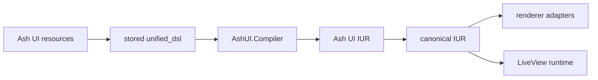

# Ash UI

Ash UI is a resource-backed UI framework for Elixir built on Ash. It stores screens, elements, and bindings as Ash data, compiles them into an internal IUR, converts that structure into canonical renderer input, and wires the result into LiveView-oriented runtime helpers.

## What Works Today

- default shipped `Screen`, `Element`, and `Binding` resources in `AshUI.Domain`
- configurable UI storage domain/resource boundary with optional repo startup
- required upstream `unified_ui` authoring surface through `AshUI.Authoring`
- `unified_dsl` persistence on screen resources
- compilation to `AshUI.Compilation.IUR` through `AshUI.Compiler`
- canonical conversion through `AshUI.Rendering.IURAdapter`
- LiveView mount, event, and update integration helpers
- runtime authorization policies and checks
- normalized telemetry events, in-memory metrics, and dashboard definitions

## Architecture at a Glance



## Quick Start

Add the core dependencies:

```elixir
defp deps do
  [
    {:ash_ui, "~> 0.1.0"},
    {:ash, "~> 3.0"},
    {:ash_postgres, "~> 2.0"},
    {:phoenix_live_view, "~> 1.0"},
    {:telemetry, "~> 1.0"}
  ]
end
```

Ash UI now treats upstream `UnifiedUi` as the authoritative authored DSL and
compiler surface. The dependency is required as part of the library contract,
and missing `unified_ui` should be treated as a configuration error rather than
an optional degraded mode.

Create a screen module through upstream `UnifiedUi.Dsl`, then persist it through
Ash UI:

```elixir
defmodule MyApp.UI.Dashboard do
  use UnifiedUi.Dsl

  identity do
    id(:dashboard)
    title("Dashboard")
    authored_ref([:my_app, :ui, :dashboard])
  end

  composition do
    root(:dashboard_root)
    mode(:screen)

    column :dashboard_shell do
      hero :dashboard_hero do
        title("Dashboard")
        message("Persisted from the authoritative UnifiedUi DSL.")
      end

      button :refresh_button do
        label("Refresh")
      end
    end
  end
end

{:ok, _screen} =
  AshUI.Authoring.create_screen(MyApp.UI.Dashboard,
    route: "/dashboard",
    layout: :column,
    metadata: %{"owner" => "platform"},
    binding_metadata: %{"refresh_button" => %{"intent" => "refresh-dashboard"}}
  )
```

Legacy builder-shaped `unified_dsl` payloads are no longer accepted at runtime.
If you are migrating older data, convert it once through
`AshUI.Authoring.migrate_legacy_dsl/2` or
`AshUI.Authoring.migrate_legacy_screen_attrs/2`, then persist the upstream
document.

The default shipped storage backend is Postgres through `AshUI.Domain` and `AshUI.Repo`, but the UI storage domain and resource modules are configurable so example apps and alternate deployments can use another Ash-compatible data layer.

Mount it in LiveView:

```elixir
defmodule MyAppWeb.DashboardLive do
  use MyAppWeb, :live_view

  alias AshUI.LiveView.Integration

  def mount(_params, _session, socket) do
    socket = assign(socket, :current_user, %{id: "admin-1", role: :admin, active: true})
    Integration.mount_ui_screen(socket, :dashboard, %{})
  end
end
```

## Renderer Status

Ash UI owns the compiler, runtime, and adapter boundary. Architecturally, the unified ecosystem renderer set is now `unified_iur`, `live_ui`, `elm_ui`, and `desktop_ui`.

The repository vendors minimal `unified_ui`, `unified_iur`, `live_ui`, `elm_ui`, and `desktop_ui` packages under `packages/`. `unified_ui` is required because it owns the authored DSL and authoring compiler surface. `unified_iur` is required because it defines the canonical schema boundary Ash UI produces and validates. The renderer packages remain optional path dependencies, and adapter fallbacks still exist for degraded environments.

## Documentation

- [User guides](/Users/Pascal/code/ash/ash_ui/guides/user/README.md)
- [Developer guides](/Users/Pascal/code/ash/ash_ui/guides/developer/README.md)
- [Guide index](/Users/Pascal/code/ash/ash_ui/guides/README.md)
- [Specifications](/Users/Pascal/code/ash/ash_ui/specs/README.md)
- [RFCs](/Users/Pascal/code/ash/ash_ui/rfcs/README.md)

Key starting points:

- [UG-0001: Getting Started](/Users/Pascal/code/ash/ash_ui/guides/user/UG-0001-getting-started.md)
- [DG-0001: Architecture Overview](/Users/Pascal/code/ash/ash_ui/guides/developer/DG-0001-architecture-overview.md)
- [Example: basic dashboard](/Users/Pascal/code/ash/ash_ui/examples/basic_dashboard/README.md)

## Current Status

Phase 8 governance work is complete, and the runtime stack now includes real Ash-backed binding execution, authorization, LiveView reactivity, compile-time resource DSL helpers, and vendored renderer package integration.

## Development Notes

- compiler cache lives in ETS and is initialized at application start
- authorization runtime also uses ETS-backed caching
- telemetry events are aggregated through `AshUI.Telemetry.snapshot/0`
- dashboard definitions live in `priv/monitoring/dashboards/`

## License

[License to be determined]
