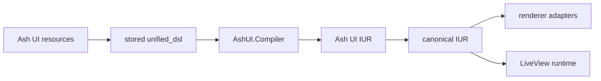

# Ash UI

Ash UI is a resource-backed UI framework for Elixir built on Ash. It stores screens, elements, and bindings as Ash data, compiles them into an internal IUR, converts that structure into canonical renderer input, and wires the result into LiveView-oriented runtime helpers.

## What Works Today

- default shipped `Screen`, `Element`, and `Binding` resources in `AshUI.Domain`
- configurable UI storage domain/resource boundary with optional repo startup
- resource-local authoring through `AshUI.Resource.DSL.Screen` and `AshUI.Resource.DSL.Element`
- `unified_dsl` persistence on screen resources
- compilation to `AshUI.Compilation.IUR` through `AshUI.Compiler`
- canonical conversion through `AshUI.Rendering.IURAdapter`
- LiveView mount, event, and update integration helpers
- runtime authorization policies and checks
- normalized telemetry events, in-memory metrics, and dashboard definitions

## Architecture at a Glance



## Quick Start

Add the core dependencies:

```elixir
defp deps do
  [
    {:ash_ui, "~> 0.1.0"},
    {:ash, "~> 3.0"},
    {:ash_postgres, "~> 2.0"},
    {:phoenix_live_view, "~> 1.0"},
    {:telemetry, "~> 1.0"}
  ]
end
```

Ash UI now treats Ash resource modules that use `AshUI.Resource.DSL.*` as the
authoritative authoring surface. `unified_ui` still matters because it owns the
shared widget and layout grammar under the hood, but application code should
model screens and elements as Ash resources rather than authoring a full screen
inside one standalone document.

Define a screen resource and related element resources, then persist the
composed graph through Ash UI:

```elixir
defmodule MyApp.UI.Domain do
  use Ash.Domain, validate_config_inclusion?: false

  resources do
    resource MyApp.UI.DashboardScreen
    resource MyApp.UI.DashboardHero
    resource MyApp.UI.RefreshButton
  end
end

defmodule MyApp.UI.DashboardHero do
  use Ash.Resource, domain: MyApp.UI.Domain, data_layer: Ash.DataLayer.Ets
  use AshUI.Resource.DSL.Element

  ets do
    private?(true)
  end

  attributes do
    uuid_primary_key(:id)
    attribute(:screen_id, :uuid, allow_nil?: true)
    attribute(:parent_id, :uuid, allow_nil?: true)
  end

  actions do
    defaults([:read])
  end

  ui_element do
    type :hero
    props %{
      eyebrow: "Resource-first example",
      title: "Dashboard",
      message: "This hero is authored as an Ash element resource."
    }
    metadata %{id: "dashboard_hero"}
  end
end

defmodule MyApp.UI.RefreshButton do
  use Ash.Resource, domain: MyApp.UI.Domain, data_layer: Ash.DataLayer.Ets
  use AshUI.Resource.DSL.Element

  ets do
    private?(true)
  end

  attributes do
    uuid_primary_key(:id)
    attribute(:screen_id, :uuid, allow_nil?: true)
    attribute(:parent_id, :uuid, allow_nil?: true)
  end

  actions do
    defaults([:read])
  end

  ui_element do
    type :button
    props %{label: "Refresh"}
    metadata %{id: "refresh_button"}
  end

  ui_actions do
    action :refresh_dashboard do
      signal :click
      source %{resource: "Dashboard", action: "refresh", id: "dashboard-1"}
      target "click"
    end
  end
end

defmodule MyApp.UI.DashboardScreen do
  use Ash.Resource, domain: MyApp.UI.Domain, data_layer: Ash.DataLayer.Ets
  use AshUI.Resource.DSL.Screen

  ets do
    private?(true)
  end

  attributes do
    uuid_primary_key(:id)
  end

  actions do
    defaults([:read])
  end

  relationships do
    has_many :hero_elements, MyApp.UI.DashboardHero do
      destination_attribute(:screen_id)
    end

    has_many :buttons, MyApp.UI.RefreshButton do
      destination_attribute(:screen_id)
    end
  end

  ui_relationships do
    relationship :hero_elements do
      kind :child
      slot :body
      placement :append
      order 0
    end

    relationship :buttons do
      kind :companion
      slot :actions
      placement :append
      order 1
    end
  end

  ui_screen do
    route "/dashboard"
    layout :column
    metadata %{"owner" => "platform"}
  end
end

{:ok, _screen} =
  AshUI.Resource.Authority.create(MyApp.UI.DashboardScreen,
    route: "/dashboard",
    layout: :column,
    metadata: %{"owner" => "platform"}
  )
```

The compiler now treats that relational authority graph as the primary source
of composition. `Screen.unified_dsl` is a persisted snapshot of the screen and
element graph, not a hand-authored monolithic document.

Older pre-v1 payloads are no longer accepted at runtime. If you are migrating
existing data, use the one-time migration flow documented in
[UG-0005](./guides/user/UG-0005-migration-v0-to-v1.md) before persisting the
resource-authority payload.

The default shipped storage backend is Postgres through `AshUI.Domain` and `AshUI.Repo`, but the UI storage domain and resource modules are configurable so example apps and alternate deployments can use another Ash-compatible data layer.

Mount it in LiveView:

```elixir
defmodule MyAppWeb.DashboardLive do
  use MyAppWeb, :live_view

  alias AshUI.LiveView.Integration

  def mount(_params, _session, socket) do
    socket = assign(socket, :current_user, %{id: "admin-1", role: :admin, active: true})
    Integration.mount_ui_screen(socket, :dashboard, %{})
  end
end
```

## Renderer Status

Ash UI owns the compiler, runtime, and adapter boundary. Architecturally, the unified ecosystem renderer set is now `unified_iur`, `live_ui`, `elm_ui`, and `desktop_ui`.

The repository vendors minimal `unified_ui`, `unified_iur`, `live_ui`, `elm_ui`, and `desktop_ui` packages under `packages/`. `unified_ui` is required because it owns the authored DSL and authoring compiler surface. `unified_iur` is required because it defines the canonical schema boundary Ash UI produces and validates. The renderer packages remain optional path dependencies, and adapter fallbacks still exist for degraded environments.

## Documentation

- [User guides](/Users/Pascal/code/ash/ash_ui/guides/user/README.md)
- [Developer guides](/Users/Pascal/code/ash/ash_ui/guides/developer/README.md)
- [Guide index](/Users/Pascal/code/ash/ash_ui/guides/README.md)
- [Specifications](/Users/Pascal/code/ash/ash_ui/specs/README.md)
- [RFCs](/Users/Pascal/code/ash/ash_ui/rfcs/README.md)

Key starting points:

- [UG-0001: Getting Started](/Users/Pascal/code/ash/ash_ui/guides/user/UG-0001-getting-started.md)
- [DG-0001: Architecture Overview](/Users/Pascal/code/ash/ash_ui/guides/developer/DG-0001-architecture-overview.md)
- [Example: basic dashboard](/Users/Pascal/code/ash/ash_ui/examples/basic_dashboard/README.md)

## Current Status

Phase 8 governance work is complete, and the runtime stack now includes real Ash-backed binding execution, authorization, LiveView reactivity, compile-time resource DSL helpers, and vendored renderer package integration.

## Development Notes

- compiler cache lives in ETS and is initialized at application start
- authorization runtime also uses ETS-backed caching
- telemetry events are aggregated through `AshUI.Telemetry.snapshot/0`
- dashboard definitions live in `priv/monitoring/dashboards/`

## License

[License to be determined]
