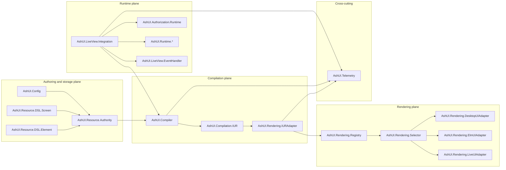

# DG-0001: Architecture and Control Planes

---
id: DG-0001
title: Architecture and Control Planes
audience: Framework Developers
status: Active
owners: Ash UI Team
last_reviewed: 2026-04-23
next_review: 2026-10-23
related_reqs: [REQ-FRAMEWORK-001, REQ-COMP-001, REQ-RENDER-001, REQ-AUTH-002, REQ-OBS-001]
related_scns: [SCN-041, SCN-061, SCN-081, SCN-101]
related_guides: [UG-0001, UG-0002, UG-0005, DG-0002, DG-0003, DG-0004]
diagram_required: true
---

## Overview

This guide explains the current AshUI architecture at the package level. The
most important design choice is that AshUI is resource-first: screen and element
resources are the authored source of truth, while persistence, compilation,
runtime, and renderer integration are separate internal control planes around
that authored graph.

Read this guide before touching storage, compiler, runtime, or renderer code.

## Prerequisites

Before reading this guide, you should:

- Know Ash resources, domains, and data layers.
- Be comfortable reading Phoenix LiveView integration code.
- Have read [UG-0001: Getting Started with AshUI](../user/UG-0001-getting-started.md).

## Control Planes

## Stable Internal Contracts

These are the boundaries contributors should preserve:

- authored UI lives in screen and element resource modules, not in hand-maintained persisted documents
- the configured UI storage boundary is separate from runtime `:ash_domains`
- `AshUI.Resource.Authority` produces the persisted `unified_dsl` snapshot from resource-local authoring
- `AshUI.Compiler` compiles from persisted screen records and authoritative graph regeneration
- canonical IUR is the renderer-facing contract
- runtime binding and action handling is validated against the owning element

If a change blurs one of those boundaries, it usually needs more than a local
code edit. It often needs guide and spec updates too.

## Package Bootstrap

The highest-signal entry points are:

- `AshUI` and `AshUI.Application` for package startup
- `AshUI.Config` for configured storage and runtime-domain boundaries
- `AshUI.Resource.Authority` for persistence from authored resources
- `AshUI.Compiler` for authoritative graph compilation and cache behavior
- `AshUI.LiveView.Integration` for end-to-end runtime behavior
- `AshUI.Rendering.IURAdapter` plus the renderer adapters for output behavior
- `AshUI.Telemetry` for cross-cutting event and metric shape

## Working Mental Model

When debugging a problem, ask these in order:

1. Is the authored screen/element graph correct?
2. Did resource authority persist the right snapshot?
3. Did the compiler regenerate and lower the right graph?
4. Did canonical conversion preserve the right widget/binding shape?
5. Did runtime hydration, event routing, or authorization change the outcome?
6. Is the renderer adapter missing support for the canonical data it received?

That order maps well to the real implementation.

## Common Debugging Entry Points

- `AshUI.Config.ui_storage/1`
- `AshUI.Resource.Authority.payload/2`
- `AshUI.Compiler.compile/2`
- `AshUI.Rendering.IURAdapter.to_canonical/2`
- `AshUI.LiveView.Integration.mount_ui_screen/3`
- `AshUI.LiveView.EventHandler.handle_event/3`
- `AshUI.Authorization.Runtime`
- `AshUI.Telemetry.snapshot/0`

## See Also

- [DG-0002: Storage, Resource Authority, and Configuration](./DG-0002-storage-resource-authority-and-configuration.md)
- [DG-0003: Compiler, Canonical IUR, Styling, and Renderers](./DG-0003-compiler-canonical-iur-and-renderers.md)
- [DG-0004: Runtime, Bindings, and Authorization](./DG-0004-runtime-bindings-and-authorization.md)
- [UG-0001: Getting Started with AshUI](../user/UG-0001-getting-started.md)
