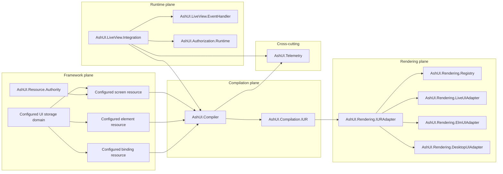

# DG-0001: Ash UI Architecture Overview

---
id: DG-0001
title: Ash UI Architecture Overview
audience: Framework Developers
status: Active
owners: Ash UI Team
last_reviewed: 2026-03-30
next_review: 2026-09-30
related_reqs: [REQ-FRAMEWORK-001, REQ-COMP-001, REQ-RENDER-001, REQ-AUTH-002, REQ-OBS-001]
related_scns: [SCN-041, SCN-061, SCN-081, SCN-101]
related_guides: [UG-0001, UG-0002, UG-0003, DG-0003]
diagram_required: true
---

## Overview

This guide explains the current Ash UI architecture as implemented in this
repository. The design is centered on screen and element Ash resources as the
authoritative UI model, with Ash UI handling persistence, compilation,
canonical conversion, runtime authorization, and renderer orchestration around
that resource graph.

## Prerequisites

Before reading this guide, you should:

- Know Ash resources, domains, and Ash data layer basics
- Be comfortable reading Phoenix LiveView integration code
- Have read [UG-0001: Getting Started](../user/UG-0001-getting-started.md)

## System Shape

Ash UI is organized around five control planes, but the codebase is intentionally practical about where responsibilities live today.

## Architectural Center of Gravity

The operational center of gravity is now:

1. Author screens and elements as Ash resources using `AshUI.Resource.DSL.*`.
2. Express composition through Ash relationships plus `ui_relationships`.
3. Keep bindings and signal-driven actions local to the resource that owns the widget.
4. Persist a `Screen` record whose `unified_dsl` is a snapshot of that authority graph.
5. Compile the composed graph into `AshUI.Compilation.IUR`.
6. Convert into canonical renderer input and mount through runtime helpers.

That means contributors should treat resource relationships plus
compiler/runtime boundaries as the most important integration seam.

The built-in modules remain `AshUI.Domain`, `AshUI.Resources.Screen`,
`AshUI.Resources.Element`, and `AshUI.Resources.Binding`, but framework code
should treat those as storage defaults behind a UI storage configuration
boundary rather than the primary application authoring API.

## Framework Plane

The framework plane owns durable UI definitions.

Primary modules:

- configured UI storage domain
- configured screen resource
- configured element resource
- configured binding resource
- `AshUI.Resource.Authority`
- `AshUI.DSL.Storage`

Important details:

- the default shipped storage backend is Postgres through `AshUI.Domain` and `AshUI.Repo`
- the framework resolves storage modules through configuration
- Ash resource modules that use `AshUI.Resource.DSL.*` are the authoritative authored surface
- `AshUI.Resource.Authority` turns that resource graph into a persisted `Screen` snapshot
- `Screen` stores `name`, `route`, `layout`, `unified_dsl`, and metadata
- default `Element` and `Binding` resources exist as backend/storage contracts, but application composition should be expressed through screen and element resource modules
- updates increment `version`, which feeds cache and rollout safety checks

## Compilation Plane

The compilation plane turns persisted screen-authority payloads plus the current
screen/element relationship graph into internal IUR.

Primary modules:

- `AshUI.Compiler`
- `AshUI.Compilation.IUR`
- `AshUI.Compiler.Extensions`
- `AshUI.Compiler.Incremental`

The active compilation path is:

- load the persisted `Screen` record
- regenerate the current runtime payload from the authoritative screen and element resource graph
- merge permitted runtime customizations from the persisted snapshot
- compile the result into `AshUI.Compilation.IUR`

Legacy builder-shaped documents are rejected at compile boundaries and only
survive as explicit migration input.

`AshUI.Compiler` also owns:

- ETS-backed compilation cache
- batch compilation helpers
- cache invalidation hooks
- telemetry for compile start, completion, and failure

## Runtime Plane

The runtime plane wires Ash UI into LiveView and binding updates.

Primary modules:

- `AshUI.LiveView.Integration`
- `AshUI.LiveView.EventHandler`
- `AshUI.LiveView.Hooks`
- `AshUI.LiveView.UpdateIntegration`
- `AshUI.Runtime.BindingEvaluator`
- `AshUI.Runtime.BidirectionalBinding`
- `AshUI.Runtime.ActionBinding`

The mount flow is:

1. read `:current_user` from the socket
2. load a screen by ID or by `name`
3. regenerate the runtime authority payload for that screen
4. authorize mount
5. compile screen to IUR and canonical IUR
6. evaluate bindings and actions
7. assign screen state onto the socket

This flow is currently the best place to inspect end-to-end behavior when debugging regressions.

One important boundary: `:ash_domains` is for binding source resolution, not UI storage. The UI storage domain/resources are a separate piece of framework configuration.

## Authorization Plane Responsibilities

Authorization is cross-cutting, but runtime enforcement is centralized in:

- `AshUI.Authorization.Runtime`
- `AshUI.Authorization.ScreenPolicy`
- `AshUI.Authorization.ElementPolicy`
- `AshUI.Authorization.BindingPolicy`

Current notable behavior:

- no implicit dev/test bypass
- explicit `:runtime_authorization_bypass` configuration exists
- inactive users are denied before protected operations continue
- authorization emits telemetry and uses ETS caching

## Rendering Plane

Ash UI does not own the final renderer implementation. It owns the conversion and integration boundary.

Primary modules:

- `AshUI.Rendering.IURAdapter`
- `AshUI.Rendering.Registry`
- `AshUI.Rendering.Selector`
- `AshUI.Rendering.LiveUIAdapter`
- `AshUI.Rendering.ElmUIAdapter`
- `AshUI.Rendering.DesktopUIAdapter`

The adapters currently support two operating modes:

- delegate to external renderer packages if those modules are installed
- fall back to local adapter output when those packages are absent

That fallback behavior is intentional and is part of current release-readiness work.

Architectural naming note:

- the external Elm-backed renderer package is `elm_ui`
- the Ash UI adapter boundary is `AshUI.Rendering.ElmUIAdapter`

## Observability

`AshUI.Telemetry` is the canonical telemetry catalog and default metrics aggregator.

Major event families:

- screen lifecycle
- binding evaluation and update
- compilation
- rendering
- authorization

Dashboards under `priv/monitoring/dashboards/` consume the normalized telemetry shape rather than ad-hoc event names.

## Design Constraints Contributors Should Respect

- Preserve the control-plane boundary: resource-authority in Ash resources, renderer behavior in adapters.
- Keep bindings and signal actions local to the owning element resource whenever possible.
- Keep canonical IUR as the renderer contract.
- Prefer additive docs and tests when changing behavior that has spec implications.
- When runtime behavior diverges from long-range RFC language, document the current state clearly rather than hiding the transition.

## Common Debugging Entry Points

- `AshUI.LiveView.Integration.mount_ui_screen/3` for mount failures
- `AshUI.Compiler.compile/2` for IUR regressions
- `AshUI.Rendering.IURAdapter.to_canonical/2` for renderer boundary issues
- `AshUI.Authorization.Runtime` for access failures
- `AshUI.Telemetry.snapshot/0` for observability checks

## See Also

- [UG-0001: Getting Started](../user/UG-0001-getting-started.md)
- [DG-0003: Testing Guide](./DG-0003-testing-guide.md)
- [.spec Workspace](../../.spec/README.md)
- [ashui.decision.control_plane_authority.md](../../.spec/decisions/ashui.decision.control_plane_authority.md)
