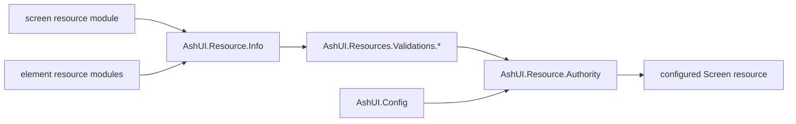

# DG-0002: Storage, Resource Authority, and Configuration

---
id: DG-0002
title: Storage, Resource Authority, and Configuration
audience: Framework Developers
status: Active
owners: Ash UI Team
last_reviewed: 2026-04-23
next_review: 2026-10-23
related_reqs: [REQ-RES-001, REQ-RES-003, REQ-SCREEN-003, REQ-BIND-003]
related_scns: [SCN-001, SCN-003, SCN-004, SCN-005, SCN-010]
related_guides: [DG-0001, DG-0003, DG-0004, UG-0002]
diagram_required: true
---

## Overview

This guide explains the internal storage and authoring boundary: how AshUI
resolves the configured UI storage modules, how screen and element resources are
introspected, and how `AshUI.Resource.Authority` turns authored resources into
persisted screen records.

If you are changing storage modules, the DSL validation path, or the shape of
persisted resource-authority payloads, start here.

## Prerequisites

Before reading this guide, you should:

- Have read [DG-0001](./DG-0001-architecture-and-control-planes.md).
- Understand the user-facing authoring DSL in [UG-0002](../user/UG-0002-authoring-screens-elements-and-relationships.md).
- Be comfortable with Ash relationships and persisted resource records.

## Storage and Authority Flow

## Configured UI Storage Boundary

`AshUI.Config` owns the separation between:

- the UI storage domain and resources used for persisted screens, elements, and bindings
- the runtime `:ash_domains` used when bindings resolve application resources

This distinction is easy to accidentally break. A contributor change that mixes
them together often causes mount, test, or policy regressions.

The effective UI storage config is built from:

- shipped defaults
- application config
- optional runtime overrides

The main readers are:

- `ui_storage/1`
- `ui_storage_domain/1`
- `screen_resource/1`
- `element_resource/1`
- `binding_resource/1`
- `runtime_domains/1`

## Resource Authority Responsibilities

`AshUI.Resource.Authority` is the persistence seam between authored resources
and stored screen records.

Its main jobs are:

- introspect screen-local definitions via `AshUI.Resource.Info`
- walk declared relationships and `ui_relationships`
- encode screen metadata, bindings, inline fragments, and element definitions
- produce a versioned persisted payload
- build `Screen` attrs and create a stored screen record through the configured storage boundary

The persisted `unified_dsl` payload is intentionally a snapshot, not the
primary authoring surface.

## Runtime Regeneration

The persisted screen record is still important at runtime, but not as the final
source of truth. The runtime path uses the stored screen as the persistence root
and then regenerates the current resource-authority payload from the authored
screen and element modules.

That is why storage changes must preserve:

- the encoded screen module reference
- screen-level metadata and overrides
- relationship order and slot semantics
- screen-scoped bindings

## Authoring Validation Path

The shared validation helpers in `AshUI.Resources.Validations.Authoring` enforce:

- allowed screen layouts
- known widget types
- allowed relationship semantics
- widget-local binding compatibility
- widget-local signal ownership
- reserved screen binding targets

These validations are part of the public authoring contract, even though they
live on the internal side of the framework.

## Storage Changes That Usually Need More Than One File

If you change any of these, expect cross-file work:

- a new public widget type
- a new authoring signal
- the persisted authority payload shape
- screen-level binding targets
- UI storage resolution behavior

Typical companion changes are:

- resource DSL or validation code
- compiler and canonical conversion code
- user and developer guide updates
- relevant `.spec/specs/*.spec.md` surfaces

## See Also

- [DG-0001: Architecture and Control Planes](./DG-0001-architecture-and-control-planes.md)
- [DG-0003: Compiler, Canonical IUR, Styling, and Renderers](./DG-0003-compiler-canonical-iur-and-renderers.md)
- [DG-0004: Runtime, Bindings, and Authorization](./DG-0004-runtime-bindings-and-authorization.md)
- [UG-0002: Authoring Screens, Elements, and Relationships](../user/UG-0002-authoring-screens-elements-and-relationships.md)
