# DG-0003: Compiler, Canonical IUR, Styling, and Renderers

---
id: DG-0003
title: Compiler, Canonical IUR, Styling, and Renderers
audience: Framework Developers
status: Active
owners: Ash UI Team
last_reviewed: 2026-05-14
next_review: 2026-11-14
related_reqs: [REQ-COMP-001, REQ-RENDER-001, REQ-RENDER-002, REQ-BIND-002, REQ-NAV-001, REQ-NAV-002, REQ-NAV-003, REQ-NAV-008, REQ-NAV-009, REQ-NAV-010, REQ-WIDGET-001, REQ-WIDGET-004, REQ-WIDGET-005, REQ-WIDGET-006, REQ-WIDGET-007, REQ-WIDGET-008, REQ-WIDGET-009]
related_scns: [SCN-041, SCN-061, SCN-101, SCN-141, SCN-144, SCN-145, SCN-165]
related_guides: [DG-0001, DG-0002, DG-0004, UG-0003, UG-0005]
diagram_required: true
---

## Overview

This guide explains how AshUI compiles persisted screens into internal IUR,
converts that IUR into canonical renderer-facing data, and selects renderer
adapters. It also explains where styling intent is carried through the
compiler/renderer pipeline. It is the guide to read before changing widget
lowering, cache behavior, canonical conversion, style prop handling, or adapter
output.

## Prerequisites

Before reading this guide, you should:

- Have read [DG-0001](./DG-0001-architecture-and-control-planes.md).
- Understand the storage and authority boundary from [DG-0002](./DG-0002-storage-resource-authority-and-configuration.md).
- Know the current public widget vocabulary from [UG-0003](../user/UG-0003-widget-types-properties-and-signals.md).

## Compilation to Canonical Output

```mermaid
flowchart LR
    Screen["persisted Screen record"]
    Compiler["AshUI.Compiler"]
    IUR["AshUI.Compilation.IUR"]
    Canonical["AshUI.Rendering.IURAdapter"]
    Registry["AshUI.Rendering.Registry"]
    Selector["AshUI.Rendering.Selector"]
    Adapter["renderer adapter"]

    Screen --> Compiler
    Compiler --> IUR
    IUR --> Canonical
    Canonical --> Registry
    Registry --> Selector
    Selector --> Adapter
```

## Compiler Responsibilities

`AshUI.Compiler` currently owns:

- loading stored screen records by id
- validating that the record belongs to the configured screen resource
- compiling from supported persisted authority payloads
- regenerating compiler input from the authoritative screen/element graph
- caching compiled results in ETS
- invalidation and cache stats
- compilation telemetry

The compiler no longer treats detached historical authoring payloads as a normal
runtime input. The supported runtime compiler path is the resource-authority
screen boundary.

## Cache Behavior

The compiler cache key includes:

- screen id
- screen version
- document-derived cache suffix

When changing compile behavior, pay attention to whether the change should
invalidate on:

- version changes
- screen-level overrides
- runtime snapshot drift

Incorrect cache semantics are easy to miss in unit-only review.

## Canonical IUR Responsibilities

`AshUI.Rendering.IURAdapter` is the renderer-facing normalization seam.

It currently:

- validates the internal IUR
- maps internal element types to `%UnifiedIUR.Element{}` `type` and `kind`
  values
- preserves renderer-facing props such as semantic classes and inline style
  payloads in canonical attributes
- lowers binding types into `%UnifiedIUR.Binding{}` values while preserving Ash
  runtime binding metadata
- compiles resource-authored navigation actions into
  `%UnifiedIUR.Interaction{}` values
- validates through the upgraded `UnifiedIUR.Normalize.element/1` and
  `UnifiedIUR.Validate.element/1` APIs
- emits conversion success and error telemetry

That means a widget change is often not complete until both the compiler and the
canonical adapter agree on the shape.

## Canonical Package Boundary

The upgraded renderer boundary is `%UnifiedIUR.Element{}`. The package set must
move together: `unified_iur`, `unified_ui`, `live_ui`, `elm_ui`, and
`desktop_ui` need compatible canonical element and interaction contracts.

Do not reintroduce the old public string-keyed map contract for upgraded
runtime paths. Legacy string-keyed maps are allowed as compatibility input for
fallback renderer helpers, but they are projected through
`AshUI.Rendering.CanonicalIUR` rather than treated as the canonical boundary.

Runtime package namespaces are also part of the boundary:

| Package | Namespace |
|---|---|
| `live_ui` | `LiveUi` |
| `elm_ui` | `ElmUi` |
| `desktop_ui` | `DesktopUi` |

Use `AshUI.Rendering.CanonicalIUR` for cross-boundary helpers such as:

- detecting canonical roots
- projecting canonical roots into legacy fallback maps
- extracting canonical navigation interactions
- extracting Ash runtime binding maps preserved inside canonical bindings

## Canonical Widget Component Catalog

The Unified package owns the canonical widget-component vocabulary.
`AshUI.WidgetComponents` is the local boundary that exposes the currently
adopted catalog to resource admission, canonical conversion, examples, and
tests. Keep catalog changes behind that wrapper so package-boundary tests can
detect drift against `UnifiedUi.WidgetComponents`.

The component adoption path has four checkpoints:

1. `AshUI.DSL.Storage` and resource authoring validation admit the canonical
   kind or supported alias.
2. `AshUI.Rendering.IURAdapter` normalizes aliases and maps props into
   component-owned canonical attribute namespaces.
3. `UnifiedIUR.Normalize.element/1` and `UnifiedIUR.Validate.element/1`
   validate the emitted `%UnifiedIUR.Element{}`.
4. Runtime adapters preserve the component kind, render a native component when
   available, or produce structured fallback diagnostics without silently
   coercing cataloged components to `custom:*`.

Current component attribute namespaces are:

| Component family | Attribute namespace examples |
|---|---|
| Content, identity, and disclosure | `:heading`, `:disclosure`, `:kicker`, `:identity`, `:presence` |
| Form control and composer | `:form`, `:selection`, `:composer` |
| Row and artifact | `:row`, `:artifact` |
| Workflow, progress, and status | `:workflow`, `:progress`, `:meter` |
| Layer shell and callout | `:shell`, `:panel`, `:callout` |
| Redline and code | `:redline`, `:code`, `:text_safety` |
| Composition behavior | `:repeat` |

Fallback renderers must keep the canonical kind visible in diagnostics or data
attributes and must escape user-provided copy. They should not introduce literal
colors, font families, or theme-owned tokens while doing so.

`list_repeat` is the exception to normal visual-component handling. It is a
relationship-owned repeat behavior. `ui_relationships` declares the list
binding, the destination `list_repeat` element owns a `binding_type :list`
binding, the compiler carries repeat metadata into props and composition
metadata, and LiveView hydration expands row-scoped templates only when row data
is present.

## Canonical Navigation Flow

Resource DSL modules accept `navigation` inside `ui_actions` and
`ui_screen_actions`. The navigation intent is normalized by
`AshUI.Navigation.Intent`, which delegates the canonical action set and forbidden
runtime field list to the upgraded Unified UI transport APIs.

`AshUI.Rendering.IURAdapter` converts each navigation action into a canonical
interaction with:

- source action id, signal, and source context
- target navigation descriptor
- payload mappings and binding refs
- Ash UI metadata and summaries

`AshUI.Runtime.Navigation` is the runtime boundary. It validates the canonical
transport descriptor, resolves symbolic screen and modal targets from the AshUI
application graph, and assigns the pending command to the LiveView socket. Host
code may execute the command through routes, patches, redirects, or modal state,
but those host details must not appear in resource-authored navigation.

## Styling Data Flow

AshUI does not have a separate global theme compiler. Styling moves through the
same resource-authority and IUR path as other widget semantics:

1. An element resource declares semantic intent in `ui_element`.
2. `AshUI.Resource.Authority` includes the element `props`, `variants`, and
   metadata in the persisted authority payload.
3. `AshUI.Compiler` turns the current resource graph into
   `AshUI.Compilation.IUR` while preserving renderer-facing props and element
   metadata.
4. `AshUI.Rendering.IURAdapter` converts the internal IUR into canonical
   `%UnifiedIUR.Element{}` structs and keeps style-relevant values in canonical
   attributes.
5. Each renderer adapter decides which props it honors and how those props map
   to platform output.

Keep the architectural boundary clear:

- resource DSL owns semantic style intent, not concrete theme implementation
- host applications own CSS tokens, shell treatments, spacing, and responsive
  layout
- canonical IUR carries renderer-facing hooks such as `class`, `inline_style`,
  and `style` in attributes but does not make them globally semantic
- renderer adapters may provide fallback classes or style attributes, but should
  not invent a cross-renderer theme contract that the rest of the system cannot
  honor

For the shipped fallback LiveView adapter, `class` is appended to generated
widget classes, `inline_style` is rendered as a style attribute, and `style` is
accepted when it is a string or a `%{extra: %{css: ...}}` shaped map. Button
`props[:variant]` also affects generated button classes. Those are adapter
behaviors, not a guarantee for every renderer.

The `variants` list on an authored element is intentionally different from
`props[:variant]`. It is preserved with the authored element definition and the
resource-authority payload. Treat any compiler or adapter change that exposes it
to renderer output as an explicit contract change, and do not silently collapse
it into `props[:variant]`.

## Type and Binding Lowering

Two internal conversions matter most:

- element kinds become canonical widget strings such as `input`, `button`, `row`, or `table`
- binding types become canonical signal families such as `bidirectional`, `collection`, and `event`

If a new widget or binding family is introduced without updating canonical
lowering, adapters either fall back incorrectly or fail validation later.

## Renderer Registry and Fallback Modes

AshUI distinguishes between:

- external renderer package availability
- local adapter fallback renderability

The renderer registry and selector decide which adapter module and mode are
available. The adapters themselves then either delegate to external packages or
generate local fallback output.

This distinction is part of the current architecture and should stay explicit in
code and docs.

## Safe Change Checklist for Widget or Renderer Work

When changing a widget family, check all of these:

- public authoring validation
- resource-authority payload generation
- compiler lowering
- canonical IUR conversion
- component catalog alias normalization and attribute mapping
- adapter output
- style intent preservation for `props`, `variants`, and metadata
- canonical struct validation through `UnifiedIUR.Normalize.element/1` and
  `UnifiedIUR.Validate.element/1`
- user-guide widget documentation
- spec surfaces for storage, compiler, rendering, or runtime

When changing canonical navigation specifically, also check:

- `AshUI.Navigation.Intent` supported action validation and forbidden field
  rejection
- `ui_actions` and `ui_screen_actions` validation
- `AshUI.Rendering.IURAdapter` interaction output
- `AshUI.Runtime.Navigation` symbolic target resolution
- Live, Elm, and desktop adapter behavior for `%UnifiedIUR.Element{}` roots
- user and developer guide traceability to `REQ-NAV-*`

When changing style or theme behavior specifically, also check:

- whether the change belongs in host CSS, an example-suite baseline, or a
  renderer adapter
- whether `class`, `style`, `inline_style`, and `variant` still round-trip
  through canonical conversion
- whether authored `variants` remain distinct from `props[:variant]` if you
  choose to expose them beyond the authority payload
- whether example-suite shell changes update
  `examples/ash_hq_theme_baseline.md`, `examples/ash_hq_theme_tokens.css`, and
  representative app-local CSS together

## See Also

- [DG-0002: Storage, Resource Authority, and Configuration](./DG-0002-storage-resource-authority-and-configuration.md)
- [DG-0004: Runtime, Bindings, and Authorization](./DG-0004-runtime-bindings-and-authorization.md)
- [DG-0005: Testing, Conformance, and Governance](./DG-0005-testing-conformance-and-governance.md)
- [UG-0003: Widget Types, Styling, Properties, and Signals](../user/UG-0003-widget-types-properties-and-signals.md)
- [UG-0005: LiveView Runtime and Rendering](../user/UG-0005-liveview-runtime-and-rendering.md)
- [examples/ash_hq_theme_baseline.md](../../examples/ash_hq_theme_baseline.md)
- [Canonical navigation contract](../../specs/contracts/canonical_navigation_contract.md)
- [ADR-0006: Canonical IUR And Navigation Adoption](../../specs/adr/ADR-0006-canonical-iur-and-navigation-adoption.md)
