# DG-0004: Runtime, Bindings, and Authorization

---
id: DG-0004
title: Runtime, Bindings, and Authorization
audience: Framework Developers
status: Active
owners: Ash UI Team
last_reviewed: 2026-04-23
next_review: 2026-10-23
related_reqs: [REQ-SCREEN-002, REQ-BIND-007, REQ-BIND-010, REQ-AUTH-002, REQ-AUTH-005]
related_scns: [SCN-021, SCN-011, SCN-081, SCN-082, SCN-084]
related_guides: [DG-0001, DG-0002, DG-0003, UG-0004, UG-0006]
diagram_required: true
---

## Overview

This guide explains the LiveView runtime path in AshUI: how screens mount, how
bindings are read and written, how action events are executed, and where
authorization is enforced. It is the guide to read before changing
`AshUI.LiveView.*`, `AshUI.Runtime.*`, or runtime authorization code.

## Prerequisites

Before reading this guide, you should:

- Have read [DG-0001](./DG-0001-architecture-and-control-planes.md).
- Understand compiler and canonical output from [DG-0003](./DG-0003-compiler-canonical-iur-and-renderers.md).
- Know the user-facing interaction model from [UG-0004](../user/UG-0004-bindings-actions-and-forms.md).

## Mount and Event Flow

```mermaid
flowchart LR
    User["socket.assigns.current_user"]
    Load["load stored screen"]
    Auth["authorize mount"]
    Compile["compile + canonicalize"]
    Eval["evaluate bindings"]
    Hydrate["assign screen state"]
    Event["change or action event"]
    Runtime["binding/action runtime"]
    Result["updated socket or error state"]

    User --> Load
    Load --> Auth
    Auth --> Compile
    Compile --> Eval
    Eval --> Hydrate
    Hydrate --> Event
    Event --> Runtime
    Runtime --> Result
```

## Main Runtime Modules

The current runtime centers on:

- `AshUI.LiveView.Integration`
- `AshUI.LiveView.EventHandler`
- `AshUI.LiveView.UpdateIntegration`
- `AshUI.LiveView.IURHydration`
- `AshUI.Runtime.BindingEvaluator`
- `AshUI.Runtime.BidirectionalBinding`
- `AshUI.Runtime.ActionBinding`
- `AshUI.Authorization.Runtime`

These modules are tightly related. A change in one often needs verification in
the others.

## Mount Path Details

`AshUI.LiveView.Integration.mount_ui_screen/3` currently:

1. reads `:current_user` from the socket
2. loads a stored screen by id or name
3. authorizes the mount
4. compiles to internal and canonical IUR
5. evaluates bindings
6. assigns the screen state
7. syncs update subscriptions

If a bug looks like “the screen never became interactive,” this is usually the
first path to inspect.

## Event Routing

The current runtime understands these event names:

- `ash_ui_change`
- `ash_ui_click`
- `ash_ui_submit`
- `ash_ui_action`

`AshUI.LiveView.EventHandler` routes them into:

- value-change handling
- action handling
- validation or error flash behavior

Ownership matters here. The runtime validates binding or action identity against
the owning element so interactions do not float freely across the screen.

## Binding and Action Runtime

The runtime side of bindings currently supports:

- evaluating value and list bindings
- sanitized bidirectional writes
- validation rules on writes
- declared element actions normalized into the action-binding execution path
- parameter mapping from event, binding, context, or static values

This means contributor changes to transform shape or event payload handling can
affect both explicit action bindings and element-owned declared actions.

## Authorization Boundaries

Runtime authorization is enforced at several points:

- screen mount
- action execution
- binding reads
- binding writes

Do not assume a successful mount implies all later operations are authorized.
That assumption causes subtle regressions in action and write paths.

## Runtime Changes That Need Extra Care

- event-name changes
- binding target lookup changes
- action parameter mapping changes
- socket assign shape changes
- authorization bypass behavior
- subscription or hydration behavior

These are user-visible quickly, even when unit tests still pass.

## See Also

- [DG-0003: Compiler, Canonical IUR, and Renderers](./DG-0003-compiler-canonical-iur-and-renderers.md)
- [DG-0005: Testing, Conformance, and Governance](./DG-0005-testing-conformance-and-governance.md)
- [UG-0004: Bindings, Actions, and Forms](../user/UG-0004-bindings-actions-and-forms.md)
- [UG-0006: Authorization and Runtime Safety](../user/UG-0006-authorization-and-runtime-safety.md)
