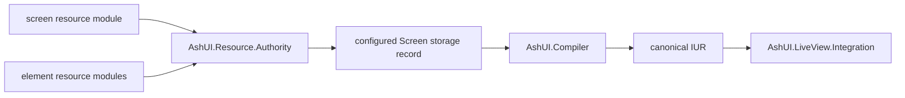

# UG-0001: Getting Started with AshUI

---
id: UG-0001
title: Getting Started with AshUI
audience: Application Developers
status: Active
owners: Ash UI Team
last_reviewed: 2026-04-23
next_review: 2026-10-23
related_reqs: [REQ-RES-001, REQ-SCREEN-001, REQ-COMP-001, REQ-RENDER-001]
related_scns: [SCN-004, SCN-021, SCN-041, SCN-061]
related_guides: [UG-0002, UG-0003, UG-0004, UG-0005, DG-0001]
diagram_required: true
---

## Overview

AshUI lets you author UI as Ash resources instead of hand-building a long-lived
widget tree in one stored document. In the current architecture, screen and
element resource modules are the authored source of truth, `AshUI.Resource.Authority`
persists a snapshot of that graph into the configured `Screen` storage resource,
and the compiler/runtime stack turns that snapshot back into canonical renderer
input for LiveView or other adapters.

This is the guide to read first because it explains the end-to-end shape before
you dive into widget details, bindings, or authorization.

## Prerequisites

Before reading this guide, you should:

- Know basic Ash resource and domain concepts.
- Be comfortable with Phoenix LiveView.
- Understand that AshUI needs a `:current_user` assign at runtime.

## The Current Mental Model

AshUI is easiest to reason about as a pipeline:



The practical implication is important: the persisted `unified_dsl` payload is a
runtime snapshot, not the primary authoring API.

## Add AshUI to Your App

Use the source that matches your environment. During local development this
often means a path dependency:

```elixir
# mix.exs
defp deps do
  [
    {:ash_ui, path: "../ash_ui"},
    {:ash, "~> 3.0"},
    {:phoenix_live_view, "~> 1.0"}
  ]
end
```

Then fetch dependencies:

```bash
mix deps.get
```

If you use the shipped Postgres-backed defaults, also configure the default UI
storage domain and repo. If you are prototyping or writing tests, ETS-backed
authoring resources are a simpler place to start.

## Author a First Screen

The minimal shape is:

1. One screen resource using `AshUI.Resource.DSL.Screen`
2. One or more element resources using `AshUI.Resource.DSL.Element`
3. Ash relationships plus `ui_relationships` to define composition order

```elixir
defmodule MyApp.UI.Domain do
  use Ash.Domain, validate_config_inclusion?: false

  resources do
    resource MyApp.UI.WelcomeScreen
    resource MyApp.UI.WelcomeHero
    resource MyApp.UI.RefreshButton
  end
end

defmodule MyApp.UI.ElementBase do
  defmacro __using__(_opts) do
    quote do
      use Ash.Resource, domain: MyApp.UI.Domain, data_layer: Ash.DataLayer.Ets
      use AshUI.Resource.DSL.Element

      ets do
        private?(true)
      end

      attributes do
        uuid_primary_key(:id)
        attribute(:screen_id, :uuid, allow_nil?: true)
        attribute(:parent_id, :uuid, allow_nil?: true)
      end

      actions do
        defaults([:read])
      end
    end
  end
end

defmodule MyApp.UI.WelcomeHero do
  use MyApp.UI.ElementBase

  ui_element do
    type :hero

    props %{
      eyebrow: "AshUI",
      title: "Screens are Ash resources",
      message: "Author resources first, then persist and mount them."
    }

    metadata %{id: "welcome_hero"}
  end
end

defmodule MyApp.UI.RefreshButton do
  use MyApp.UI.ElementBase

  ui_element do
    type :button
    props %{label: "Refresh", variant: "primary"}
    metadata %{id: "refresh_button"}
  end

  ui_actions do
    action :refresh_dashboard do
      signal :click
      target "refresh"
      source %{resource: "Demo.Dashboard", action: "refresh", id: "dashboard-1"}
      transform %{}
    end
  end
end

defmodule MyApp.UI.WelcomeScreen do
  use Ash.Resource, domain: MyApp.UI.Domain, data_layer: Ash.DataLayer.Ets
  use AshUI.Resource.DSL.Screen

  ets do
    private?(true)
  end

  attributes do
    uuid_primary_key(:id)
  end

  actions do
    defaults([:read])
  end

  relationships do
    has_many :hero_elements, MyApp.UI.WelcomeHero do
      destination_attribute(:screen_id)
    end

    has_many :action_buttons, MyApp.UI.RefreshButton do
      destination_attribute(:screen_id)
    end
  end

  ui_relationships do
    relationship :hero_elements do
      kind :child
      slot :body
      placement :append
      order 0
    end

    relationship :action_buttons do
      kind :companion
      slot :actions
      placement :append
      order 1
    end
  end

  ui_screen do
    layout :column
    route "/welcome"
    metadata %{title: "Welcome"}
  end
end
```

## Persist the Authored Screen

Runtime loading works from the configured `Screen` storage resource, so the
usual next step is to persist the resource-authority snapshot:

```elixir
alias AshUI.Resource.Authority

{:ok, _screen_record} =
  Authority.create(MyApp.UI.WelcomeScreen,
    name: "welcome",
    route: "/welcome",
    metadata: %{title: "Welcome"}
  )
```

`Authority.create/2` stores the compiled authoring snapshot into the configured
screen resource. Later compiler/runtime calls use that persisted record as the
load root.

## Mount the Screen in LiveView

```elixir
defmodule MyAppWeb.WelcomeLive do
  use MyAppWeb, :live_view

  alias AshUI.LiveView.Integration

  def mount(_params, _session, socket) do
    socket =
      assign(socket, :current_user, %{id: "admin-1", role: :admin, active: true})

    Integration.mount_ui_screen(socket, :welcome, %{})
  end
end
```

On mount, AshUI currently:

1. Reads `:current_user` from the socket.
2. Loads the persisted screen by id or name.
3. Authorizes the mount.
4. Compiles the screen into internal IUR and canonical IUR.
5. Evaluates bindings.
6. Assigns screen state back onto the socket.

## What to Learn Next

After this first screen works:

- Read [UG-0002](./UG-0002-authoring-screens-elements-and-relationships.md) for the full resource-local DSL.
- Read [UG-0003](./UG-0003-widget-types-properties-and-signals.md) before designing a larger widget library.
- Read [UG-0004](./UG-0004-bindings-actions-and-forms.md) when you need interactive screens.

## See Also

- [UG-0002: Authoring Screens, Elements, and Relationships](./UG-0002-authoring-screens-elements-and-relationships.md)
- [UG-0005: LiveView Runtime and Rendering](./UG-0005-liveview-runtime-and-rendering.md)
- [DG-0001: Architecture and Control Planes](../developer/DG-0001-architecture-and-control-planes.md)
- [Resource contract](../../specs/contracts/resource_contract.md)
