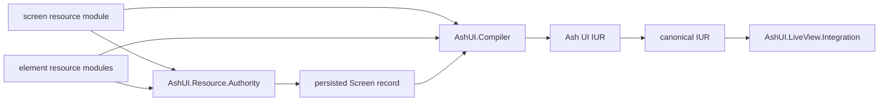

# UG-0001: Getting Started with Ash UI

---
id: UG-0001
title: Getting Started with Ash UI
audience: Application Developers
status: Active
owners: Ash UI Team
last_reviewed: 2026-03-30
next_review: 2026-09-30
related_reqs: [REQ-RES-001, REQ-SCREEN-001, REQ-COMP-001, REQ-RENDER-001]
related_scns: [SCN-004, SCN-021, SCN-041, SCN-061]
related_guides: [UG-0002, UG-0003, UG-0004, DG-0001]
diagram_required: true
---

## Overview

This guide shows the shortest realistic path to getting Ash UI running in an
application today. The current system centers on screen and element Ash
resources using the Ash UI DSL extension, relationship-driven composition,
element-local bindings and actions, a persisted `Screen.unified_dsl` snapshot,
and a compiler/runtime stack that turns that authority graph into renderer
output.

## Prerequisites

Before reading this guide, you should:

- Be comfortable with Elixir and Mix
- Have a Phoenix application with LiveView enabled
- Understand basic Ash resource and domain concepts
- Have read your app's UI storage setup docs

## How Ash UI Flows

The most important thing to understand is that Ash UI treats screen and element
resources as the authored source of truth, then persists a screen snapshot of
that graph for runtime loading and compilation.



## Install Dependencies

Add Ash UI and the runtime dependencies it uses today:

```elixir
# mix.exs
defp deps do
  [
    {:ash_ui, "~> 0.1.0"},
    {:ash, "~> 3.0"},
    {:ash_postgres, "~> 2.0"},
    {:phoenix_live_view, "~> 1.0"},
    {:telemetry, "~> 1.0"}
  ]
end
```

Fetch dependencies:

```bash
mix deps.get
```

## Create a First Screen

Ash UI ships storage resources for you:

- `AshUI.Resources.Screen`
- `AshUI.Resources.Element`
- `AshUI.Resources.Binding`

Those are the default persistence backend. The supported application authoring
path is to define one screen resource plus the element resources it composes,
then persist the authority graph through `AshUI.Resource.Authority`.

The default shipped setup uses `AshUI.Domain` with Postgres-backed resources, but the UI storage domain and resource modules are configurable if your app wants ETS-backed or other Ash-compatible storage.

```elixir
defmodule MyApp.UI.Domain do
  use Ash.Domain, validate_config_inclusion?: false

  resources do
    resource MyApp.UI.DashboardScreen
    resource MyApp.UI.DashboardHero
    resource MyApp.UI.RefreshButton
  end
end

defmodule MyApp.UI.DashboardHero do
  use Ash.Resource, domain: MyApp.UI.Domain, data_layer: Ash.DataLayer.Ets
  use AshUI.Resource.DSL.Element

  ets do
    private?(true)
  end

  attributes do
    uuid_primary_key(:id)
    attribute(:screen_id, :uuid, allow_nil?: true)
    attribute(:parent_id, :uuid, allow_nil?: true)
  end

  actions do
    defaults([:read])
  end

  ui_element do
    type :hero
    props %{
      eyebrow: "Operations",
      title: "Team dashboard",
      message: "Everything below is authored as Ash resources and stored as Ash data."
    }
    metadata %{id: "dashboard_hero"}
  end

  ui_bindings do
    binding :hero_message do
      source %{resource: "SystemStatus", field: "summary", id: "primary"}
      target "message"
      binding_type :value
      transform %{}
    end
  end
end

defmodule MyApp.UI.RefreshButton do
  use Ash.Resource, domain: MyApp.UI.Domain, data_layer: Ash.DataLayer.Ets
  use AshUI.Resource.DSL.Element

  ets do
    private?(true)
  end

  attributes do
    uuid_primary_key(:id)
    attribute(:screen_id, :uuid, allow_nil?: true)
    attribute(:parent_id, :uuid, allow_nil?: true)
  end

  actions do
    defaults([:read])
  end

  ui_element do
    type :button
    props %{label: "Refresh"}
    metadata %{id: "refresh_button"}
  end

  ui_actions do
    action :refresh_dashboard do
      signal :click
      target "click"
      source %{resource: "Dashboard", action: "refresh", id: "dashboard-1"}
      transform %{}
    end
  end
end

defmodule MyApp.UI.DashboardScreen do
  use Ash.Resource, domain: MyApp.UI.Domain, data_layer: Ash.DataLayer.Ets
  use AshUI.Resource.DSL.Screen

  ets do
    private?(true)
  end

  attributes do
    uuid_primary_key(:id)
  end

  actions do
    defaults([:read])
  end

  relationships do
    has_many :hero_elements, MyApp.UI.DashboardHero do
      destination_attribute(:screen_id)
    end

    has_many :buttons, MyApp.UI.RefreshButton do
      destination_attribute(:screen_id)
    end
  end

  ui_relationships do
    relationship :hero_elements do
      kind :child
      slot :body
      placement :append
      order 0
    end

    relationship :buttons do
      kind :companion
      slot :actions
      placement :append
      order 1
    end
  end

  ui_screen do
    route "/dashboard"
    layout :column
    metadata %{"title" => "Dashboard"}
  end
end

{:ok, screen} =
  AshUI.Resource.Authority.create(MyApp.UI.DashboardScreen,
    route: "/dashboard",
    layout: :column,
    metadata: %{"title" => "Dashboard"}
  )
```

`AshUI.Resource.Authority.screen_attrs/2` is useful when you want to inspect
the persisted payload before writing the screen record or merge in app-specific
screen attributes.

Ash UI no longer accepts older pre-v1 `unified_dsl` payloads at load or compile
time. If you are migrating existing screens, follow the explicit one-time
migration flow in [UG-0005](./UG-0005-migration-v0-to-v1.md) before persisting
them. Inline screen DSL remains available, but only as a secondary escape hatch
for shell chrome and layout glue.

The important authoring rule is locality:

- `ui_relationships` defines how a screen or element composes related element resources
- `ui_bindings` lives on the resource that owns the data-driven widget
- `ui_actions` lives on the resource that owns the signal-emitting widget
- `inline_fragment` is only for small shell wrappers where another element resource would be overkill

## Mount the Screen in LiveView

`AshUI.LiveView.Integration.mount_ui_screen/3` loads the screen, authorizes it, compiles it, evaluates its bindings, and assigns the result onto the socket.

```elixir
defmodule MyAppWeb.DashboardLive do
  use MyAppWeb, :live_view

  alias AshUI.LiveView.Integration

  def mount(_params, _session, socket) do
    socket = assign(socket, :current_user, %{id: "admin-1", role: :admin, active: true})

    case Integration.mount_ui_screen(socket, :dashboard, %{}) do
      {:ok, socket} -> {:ok, socket}
      {:error, reason} -> {:ok, assign(socket, :ash_ui_error, reason)}
    end
  end
end
```

After mount, these assigns are available:

- `:ash_ui_screen`
- `:ash_ui_iur`
- `:ash_ui_bindings`
- `:ash_ui_user`
- `:ash_ui_loaded_at`

## Storage Configuration

Ash UI distinguishes between:

- **UI storage** for persisted `Screen`, `Element`, and `Binding` backend resources
- **runtime data domains** used by bindings to read and write application data
- **authoring resources** in your app that use `AshUI.Resource.DSL.Screen` and `AshUI.Resource.DSL.Element`

The default UI storage configuration is built in, but apps may override it:

```elixir
config :ash_ui,
  ui_storage: [
    domain: AshUI.Domain,
    resources: [
      screen: AshUI.Resources.Screen,
      element: AshUI.Resources.Element,
      binding: AshUI.Resources.Binding
    ],
    repo: AshUI.Repo
  ]
```

When bindings need to resolve application data resources, continue configuring `:ash_domains` separately.

## Inspect or Render the Result

Today Ash UI reliably gives you canonical screen data and fallback renderer adapters. A practical first step is to inspect the assigned IUR while wiring your UI.

```elixir
~H"""
<section>
  <h1>{@ash_ui_screen.name}</h1>
  <pre><%= inspect(@ash_ui_iur, pretty: true) %></pre>
</section>
"""
```

If you want fallback HEEx or HTML output, you can render the compiled structure directly:

```elixir
alias AshUI.Rendering.LiveUIAdapter

{:ok, heex} = LiveUIAdapter.render(@ash_ui_iur)
```

## Add Reactive Bindings And Actions

Bindings and actions belong on the element resource that owns the widget. That
keeps runtime behavior local to the UI fragment it drives.

```elixir
defmodule MyApp.UI.DisplayNameInput do
  use Ash.Resource, domain: MyApp.UI.Domain, data_layer: Ash.DataLayer.Ets
  use AshUI.Resource.DSL.Element

  ets do
    private?(true)
  end

  attributes do
    uuid_primary_key(:id)
    attribute(:screen_id, :uuid, allow_nil?: true)
    attribute(:parent_id, :uuid, allow_nil?: true)
  end

  actions do
    defaults([:read])
  end

  ui_element do
    type :textinput
    props %{label: "Display name"}
    metadata %{id: "display_name_input"}
  end

  ui_bindings do
    binding :display_name do
      source %{resource: "User", field: "name", id: "user-1"}
      target "value"
      binding_type :value
      transform [%{"function" => "trim"}]
    end
  end

  ui_actions do
    action :save_profile do
      signal :submit
      target "submit"
      source %{resource: "User", action: "save_profile", id: "user-1"}
      transform %{
        "params" => %{
          "display_name" => %{"from" => "binding", "key" => "display_name"}
        }
      }
    end
  end
end
```

## Handle LiveView Events

Ash UI includes helper modules for value changes and action dispatch:

```elixir
def handle_event("ash_ui_change", params, socket) do
  AshUI.LiveView.EventHandler.handle_value_change(params, socket)
end

def handle_event("ash_ui_action", params, socket) do
  AshUI.LiveView.EventHandler.handle_action_event(params, socket)
end
```

## Common First Checks

### Screen fails to mount

Confirm the socket includes `:current_user`, the user is active, the screen exists under the requested name or ID, and your app's UI storage configuration points at the expected screen resource.

### Bindings stay empty

Check that:

- the element resource is part of the screen relationship graph
- `binding_type` is one of `:value` or `:list` for `ui_bindings`
- signal-driven behavior is declared in `ui_actions`
- `source` is a map with at least `"resource"` plus `"field"` or `"action"`

### Rendering looks incomplete

That is expected if external renderer packages are not installed. Ash UI currently falls back to adapter-provided output until `live_ui`, `elm_ui`, or `desktop_ui` are available.

## See Also

- [UG-0002: Working with Resources](./UG-0002-resources.md)
- [UG-0003: Data Binding](./UG-0003-data-binding.md)
- [UG-0004: Authorization](./UG-0004-authorization.md)
- [DG-0001: Architecture Overview](../developer/DG-0001-architecture-overview.md)
- [README](/Users/Pascal/code/ash/ash_ui/README.md)
