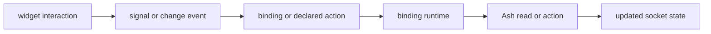

# UG-0004: Bindings, Actions, and Forms

---
id: UG-0004
title: Bindings, Actions, and Forms
audience: Application Developers
status: Active
owners: Ash UI Team
last_reviewed: 2026-04-25
next_review: 2026-10-25
related_reqs: [REQ-BIND-001, REQ-BIND-002, REQ-BIND-003, REQ-BIND-007, REQ-BIND-008, REQ-BIND-010]
related_scns: [SCN-006, SCN-007, SCN-009, SCN-010, SCN-011, SCN-021]
related_guides: [UG-0002, UG-0003, UG-0005, UG-0006, DG-0004, DG-0005]
diagram_required: true
---

## Overview

Bindings are how AshUI moves data between Ash resources and widgets. Actions are
how widgets trigger work. In the current runtime, both travel through the same
compiler/runtime pipeline and are enforced against the owning element.

This guide explains the supported binding shapes, practical form authoring, and
the signal model behind interactive widgets.

## Prerequisites

Before reading this guide, you should:

- Have read [UG-0002](./UG-0002-authoring-screens-elements-and-relationships.md).
- Know the current widget signal matrix from [UG-0003](./UG-0003-widget-types-properties-and-signals.md).
- Be comfortable with Ash read and action concepts.

## The Three Binding Types

AshUI currently supports exactly three binding types:

| Type | Purpose |
|---|---|
| `:value` | Read a single field or relationship value and optionally write changes back |
| `:list` | Load a collection for collection-capable widgets |
| `:action` | Execute an Ash action in response to UI interaction |

Source maps are validated before runtime use.

## Source Map Rules

### `:value`

A value binding source must include:

- `resource`
- either `field` or `relationship`

Example:

```elixir
binding :display_name do
  source %{resource: "Demo.User", field: "name", id: "user-1"}
  target "display_name"
  binding_type :value
  transform %{}
end
```

### `:list`

A list binding source must include:

- `resource`

It usually also includes relationship, filters, or app-specific metadata that
your runtime resource access layer understands.

### `:action`

An action binding source must include:

- `resource`
- `action`

Example:

```elixir
binding :create_user do
  source %{resource: "Demo.User", action: "create"}
  target "create_user"
  binding_type :action
  transform %{}
end
```

## How Events Flow



## Declared Actions vs `binding_type :action`

You have two closely related options:

- `ui_actions` on an element resource
- `binding_type :action` bindings

At runtime, declared actions are normalized into the same action-binding path.
Use whichever makes ownership clearer in your screen design. In practice:

- use `ui_actions` for element-local signals such as button clicks
- use explicit action bindings when a binding-shaped workflow reads more clearly in your app

## Form Authoring Pattern That Fits AshUI Today

The safest current form pattern is:

1. Use `form_field` as a structural wrapper
2. Put the interactive widget on a separate element resource
3. Keep the value binding on the interactive widget
4. Keep submit actions on the button that owns the trigger

```elixir
defmodule MyApp.UI.NameInput do
  use MyApp.UI.ElementBase

  ui_element do
    type :input
    props %{name: "display_name", placeholder: "Display name", type: "text"}
    metadata %{id: "display_name_input"}
  end

  ui_bindings do
    binding :display_name_input do
      source %{resource: "Demo.User", field: "name", id: "user-1"}
      target "display_name"
      binding_type :value

      transform %{
        "sanitize" => [%{"type" => "trim"}],
        "validate" => [
          %{"type" => "required"},
          %{"type" => "min_length", "value" => 2}
        ]
      }
    end
  end
end

defmodule MyApp.UI.SaveButton do
  use MyApp.UI.ElementBase

  ui_element do
    type :button
    props %{label: "Save", variant: "primary"}
    metadata %{id: "save_button"}
  end

  ui_actions do
    action :save_profile do
      signal :click
      source %{resource: "Demo.Profile", action: "save_profile", id: "user-1"}
      target "submit"

      transform %{
        params: %{
          display_name: %{"from" => "binding", "key" => "display_name"}
        }
      }
    end
  end
end
```

## Transform Rules That Matter in Practice

### Value-binding transforms

The bidirectional runtime currently looks for:

- `transform["validate"]`
- `transform["sanitize"]`

Built-in validation rules currently include:

- `required`
- `min_length`
- `max_length`

Built-in sanitization rules currently include:

- `trim`
- `strip_tags` placeholder behavior

### Action parameter mapping

Action bindings and declared actions can map params from:

- `event`
- `binding`
- `context`
- `static`

Both `"from"` and `"source"` spellings are supported by the runtime mapper.

## Current Form Caveats

- `form_builder` is part of the current validated public vocabulary and supports submit-scoped actions, but it remains a thin form shell in the shipped fallback renderer.
- `radio` and `switch` are signal-capable and now have dedicated fallback markup; `slider` is still validation-capable without dedicated shipped fallback markup.
- `form_field` is mainly structural in the shipped fallback renderer. Labels, help text, and richer semantics depend on your renderer path.

## Troubleshooting

### A binding fails validation during authoring

Check the source map first. The most common issue is a missing required key such
as `field` for `:value` or `action` for `:action`.

### A signal is rejected on an element

Check the widget type against the signal matrix in [UG-0003](./UG-0003-widget-types-properties-and-signals.md). Signals are not interchangeable across widgets.

### A form prop exists but nothing visible changes

That usually means the prop is stored in `props` but the shipped fallback
renderer does not explicitly read it. Treat that as a renderer boundary issue,
not a binding issue.

## See Also

- [UG-0003: Widget Types, Properties, and Signals](./UG-0003-widget-types-properties-and-signals.md)
- [UG-0005: LiveView Runtime and Rendering](./UG-0005-liveview-runtime-and-rendering.md)
- [UG-0006: Authorization and Runtime Safety](./UG-0006-authorization-and-runtime-safety.md)
- [Binding contract](../../specs/contracts/binding_contract.md)
