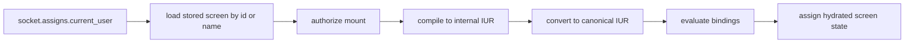

# UG-0005: LiveView Runtime and Rendering

---
id: UG-0005
title: LiveView Runtime and Rendering
audience: Application Developers
status: Active
owners: Ash UI Team
last_reviewed: 2026-04-23
next_review: 2026-10-23
related_reqs: [REQ-SCREEN-002, REQ-COMP-001, REQ-RENDER-001, REQ-RENDER-002]
related_scns: [SCN-021, SCN-041, SCN-061, SCN-101]
related_guides: [UG-0001, UG-0003, UG-0004, UG-0006, DG-0001]
diagram_required: true
---

## Overview

AshUI's runtime is primarily a LiveView integration layer around persisted
screen records, compiler output, binding hydration, and event routing. The
important thing for application authors is that the runtime loads stored screen
records, regenerates the authoritative graph, compiles that graph to canonical
IUR, then renders and updates it through the selected adapter.

This guide explains what that means in practice.

## Prerequisites

Before reading this guide, you should:

- Have read [UG-0001](./UG-0001-getting-started.md).
- Know the binding and action model from [UG-0004](./UG-0004-bindings-actions-and-forms.md).
- Understand which widgets your renderer path can display today.

## Mount Flow

The shipped mount path is:



In code, the entry point is `AshUI.LiveView.Integration.mount_ui_screen/3`.

```elixir
def mount(params, _session, socket) do
  socket = assign(socket, :current_user, %{id: "user-1", role: :editor, active: true})
  AshUI.LiveView.Integration.mount_ui_screen(socket, :welcome, params)
end
```

## What `mount_ui_screen/3` Expects

The current runtime expects:

- `socket.assigns.current_user`
- a persisted screen identifiable by name or id
- access to the configured UI storage boundary

It will fail early if no current user exists.

## Canonical IUR and Why It Matters

AshUI does not render directly from your screen resource module. It compiles to
internal IUR, converts that to canonical IUR, and only then hands the result to
renderer adapters.

That gives you two important guarantees:

- the renderer sees normalized widget and binding data
- app authoring stays separate from renderer selection

## Event Routing in LiveView

The current event handler understands these event names:

| Event name | Meaning |
|---|---|
| `ash_ui_change` | Value-change path |
| `ash_ui_click` | Click action path |
| `ash_ui_submit` | Submit action path |
| `ash_ui_action` | Generic action path used by buttons in the fallback adapter |

The fallback LiveView adapter currently emits:

- `phx-click` for `button`
- `phx-blur` and `phx-change` for `input` and `textarea`
- `phx-change` for `select`
- `phx-click` for `checkbox`

At runtime, AshUI routes those events by binding id, action id, target,
element id, and signal.

## Renderer Reality Today

AshUI owns the compiler, canonical conversion, and adapter boundary. It does
not mean every widget has equally rich fallback rendering in every adapter.

Today:

- LiveView is the most complete shipped runtime path.
- The fallback LiveView adapter explicitly renders `row`, `column`, `grid`, `stack`, `card`, `text`, `label`, `badge`, `hero`, `stat`, `key_value`, `info_list`, `form_builder`, `form_field`, `button`, `input`, `textarea`, `checkbox`, `select`, `divider`, and `spacer`.
- Types outside that set survive as canonical widgets but fall back to generic wrapper markup unless an external renderer package handles them.
- The desktop adapter is narrower and explicitly covers only a smaller interactive subset.

## Reactive Updates and Hydration

After bindings are evaluated, AshUI hydrates the current binding state back onto
the canonical tree. When resource updates arrive, the LiveView update path can
re-evaluate bindings and refresh the rendered state without rebuilding the whole
authoring story by hand.

For application authors, that means:

- keep stable element ids
- keep bindings local to the interactive element
- expect the runtime to own the read/write loop

## Runtime Failure Modes to Expect

If something goes wrong, the current LiveView helpers are designed to return a
recoverable error result instead of crashing the session for ordinary binding or
action failures.

The common causes are:

- missing `current_user`
- screen not found
- authorization failure
- invalid binding target or source
- unsupported renderer expectations for a given widget

## See Also

- [UG-0004: Bindings, Actions, and Forms](./UG-0004-bindings-actions-and-forms.md)
- [UG-0006: Authorization and Runtime Safety](./UG-0006-authorization-and-runtime-safety.md)
- [UG-0007: Data Surfaces and Composition Patterns](./UG-0007-data-surfaces-and-composition-patterns.md)
- [Rendering contract](../../specs/contracts/rendering_contract.md)
