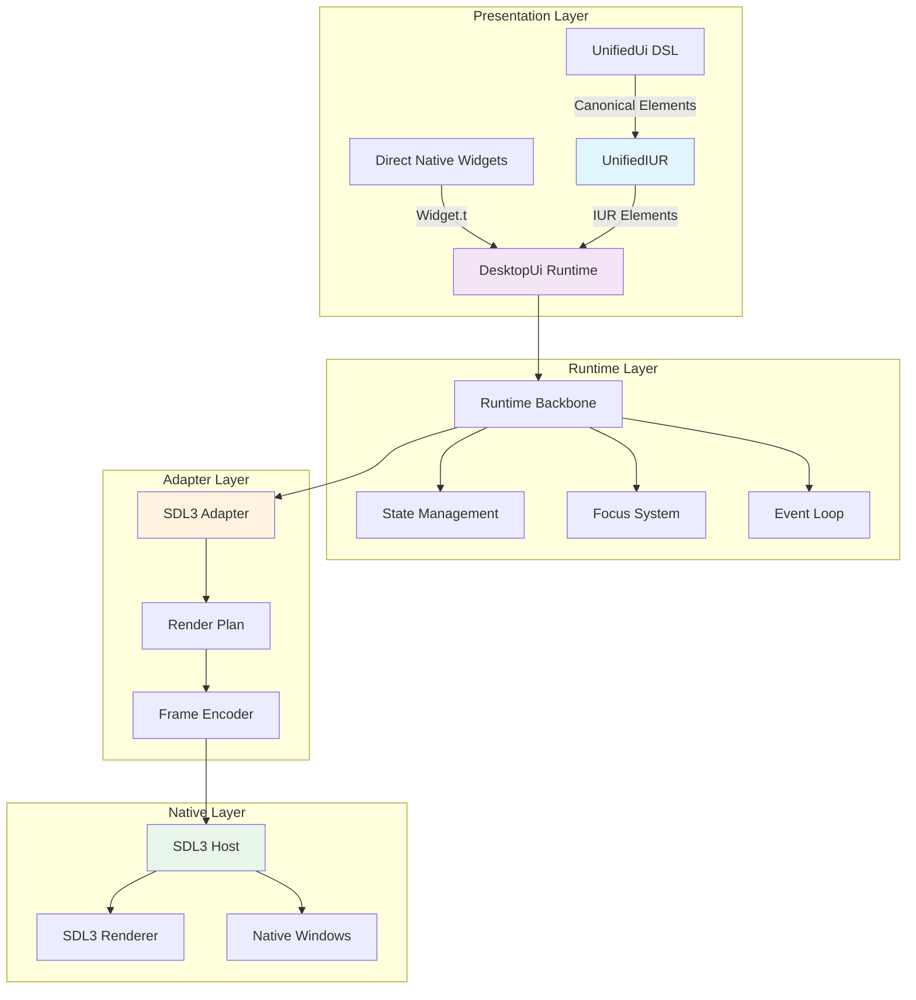
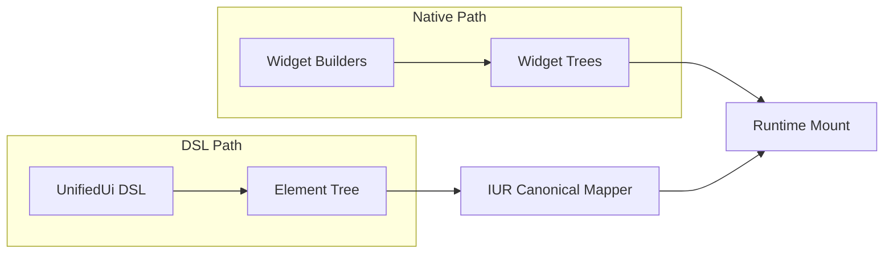
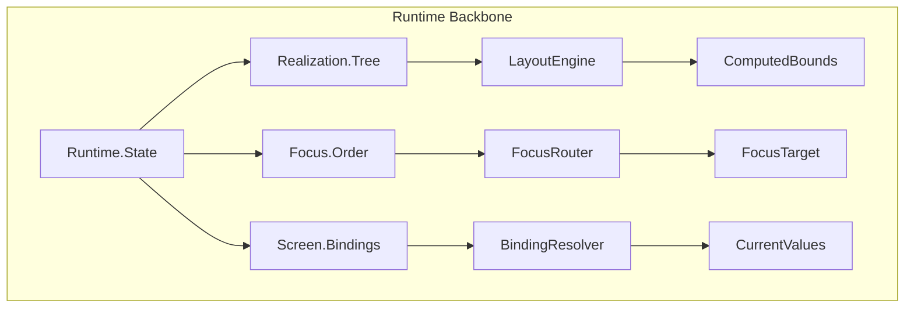
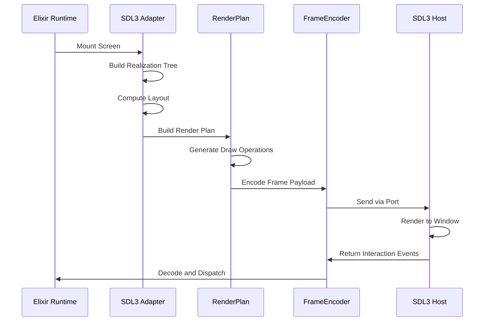
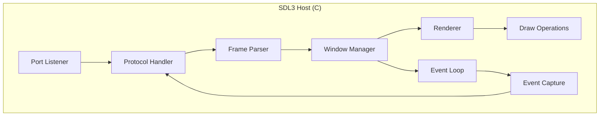
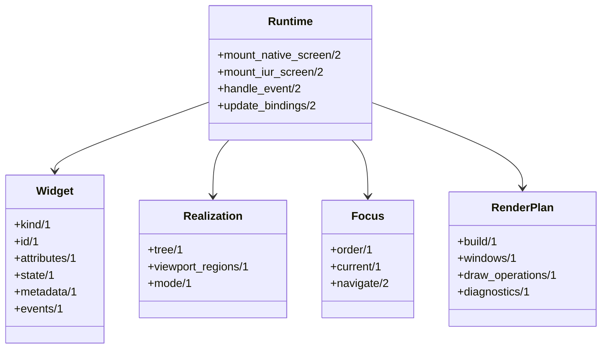
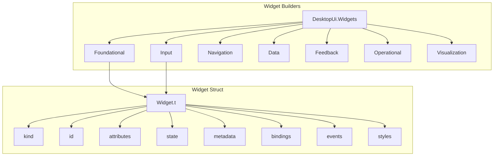
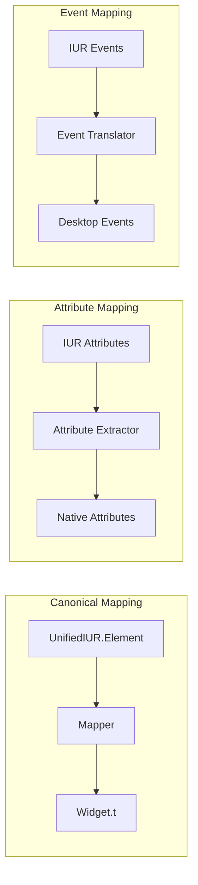
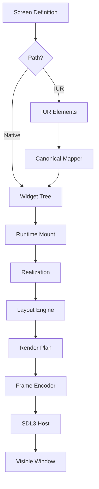
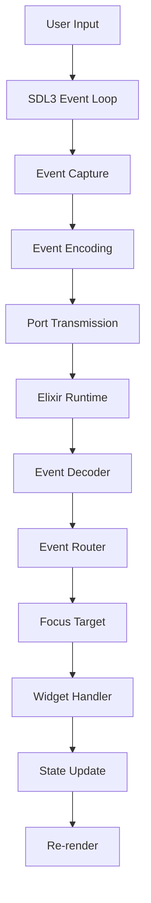

# DesktopUi Architecture Overview

This guide provides a comprehensive overview of the DesktopUi package architecture, including its layers, components, and data flows.

## Table of Contents
1. [High-Level Architecture](#high-level-architecture)
2. [Layered Design](#layered-design)
3. [Component Overview](#component-overview)
4. [Data Flow](#data-flow)
5. [Key Abstractions](#key-abstractions)

## High-Level Architecture

DesktopUi follows a **4-layer architecture** that enables both direct native widget usage and canonical IUR rendering through a unified runtime model.



## Layered Design

### 1. Presentation Layer

The presentation layer provides two complementary entry points:



**DSL Path**: For users authoring screens in the UnifiedUi DSL
- Produces `UnifiedIUR.Element` structs
- Mapped through canonical renderer to native widgets
- Enables cross-runtime compatibility (desktop_ui, live_ui, etc.)

**Native Path**: For direct native widget construction
- Uses `DesktopUi.Widgets.*` builders
- Produces `DesktopUi.Widget` structs directly
- Full access to native-specific features

### 2. Runtime Layer

The runtime layer manages the shared execution model:



### 3. Adapter Layer

The SDL3 adapter bridges Elixir runtime to native execution:



### 4. Native Layer

The native layer handles actual rendering and input:



## Component Overview

### Core Components



### Widget System Components



### IUR Renderer Components



## Data Flow

### Screen Rendering Flow



### Event Handling Flow



## Key Abstractions

### Widget Abstraction

All widgets share a common structure:

```elixir
%DesktopUi.Widget{
  kind: :button,           # Widget type
  id: "submit-btn",        # Unique identifier
  attributes: %{           # Static properties
    label: "Submit"
  },
  state: %{                # Dynamic state
    disabled: false,
    focused: false
  },
  metadata: %{             # Runtime metadata
    focusable: true,
    role: :button
  },
  bindings: %{             # Data bindings
    form_state: :my_form
  },
  events: %{               # Event handlers
    click: %{intent: :submit_form}
  },
  styles: %{               # Styling
    bg: "primary",
    fg: "light"
  }
}
```

### Screen Abstraction

Screens are the root container for widget trees:

```elixir
%{
  id: "my-screen",
  title: "My Application",
  root: %DesktopUi.Widget{
    kind: :column,
    id: "root",
    children: [
      # ... widget tree
    ]
  }
}
```

### Frame Abstraction

Frames represent the rendered output sent to the native host:

```elixir
%DesktopUi.Sdl3.Frame{
  windows: [
    %{
      window_id: "main",
      title: "My App",
      draw_operations: [
        # ... draw ops
      ]
    }
  ]
}
```

## Related Guides

- [Component Design](./component-design.md)
- [SDL3 Integration](./sdl3-integration.md)
- [IUR Renderer Architecture](./iur-renderer.md)
- [Widget System](./widget-system.md)
- [Runtime Backbone](./runtime-backbone.md)
