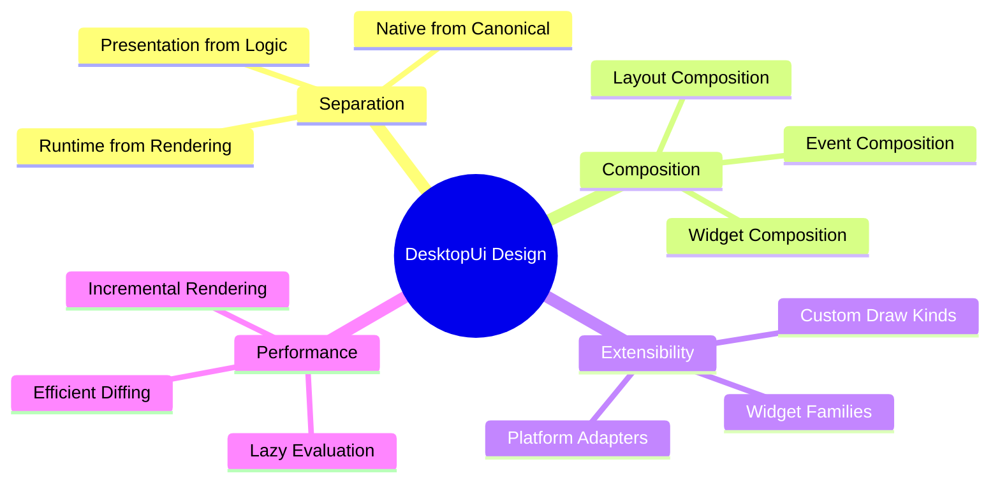
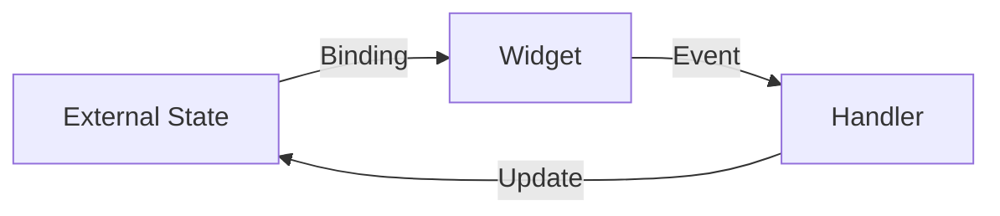
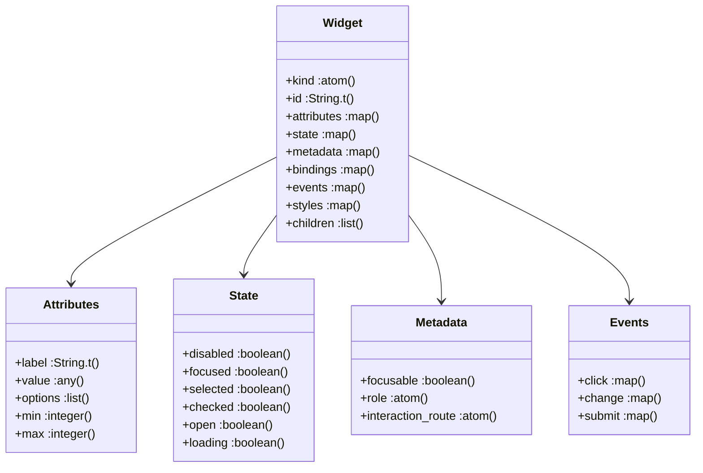
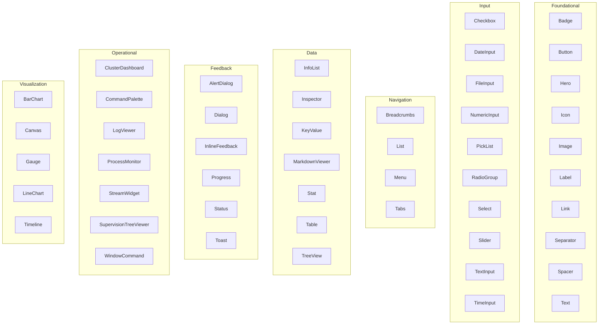
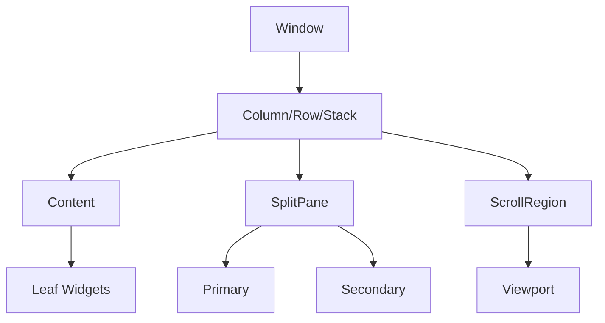
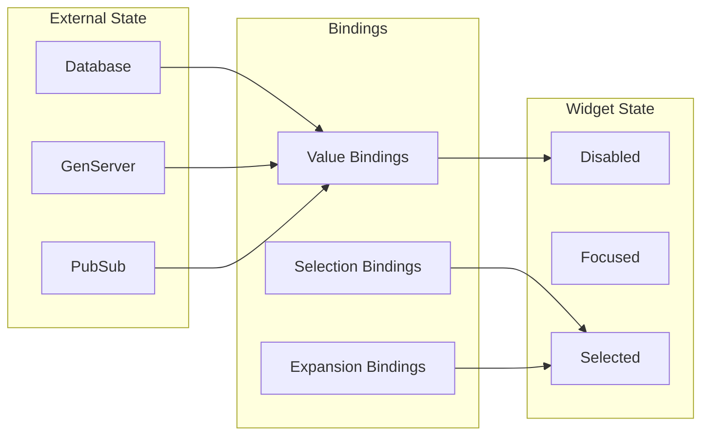
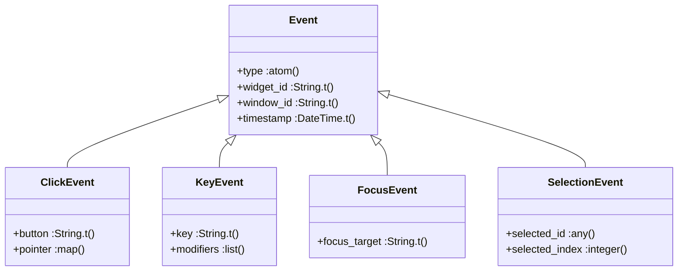
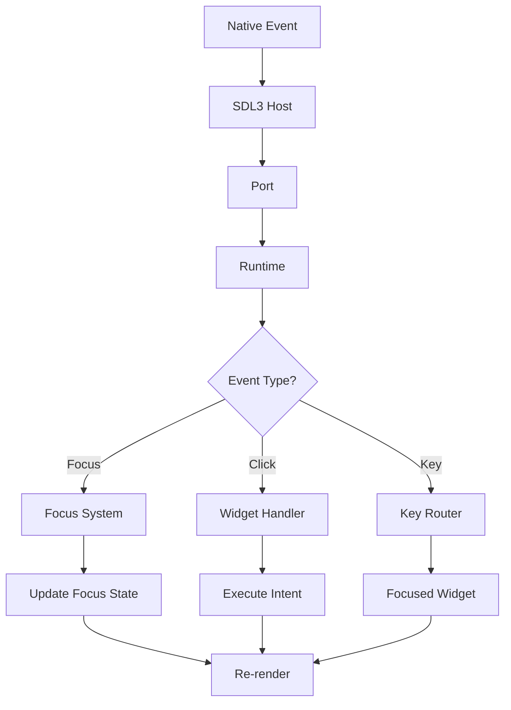
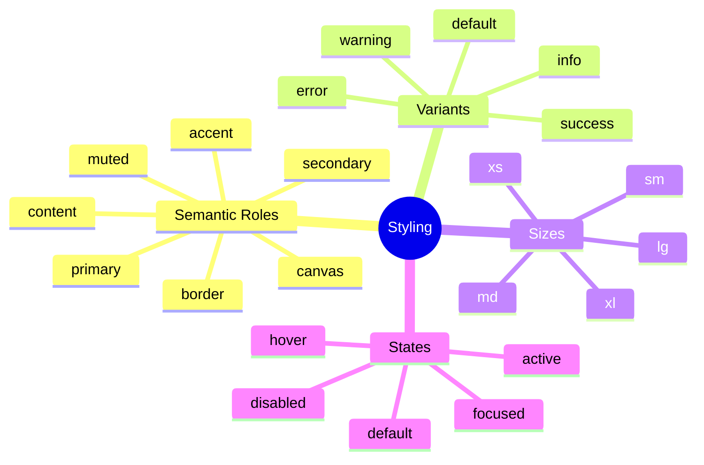
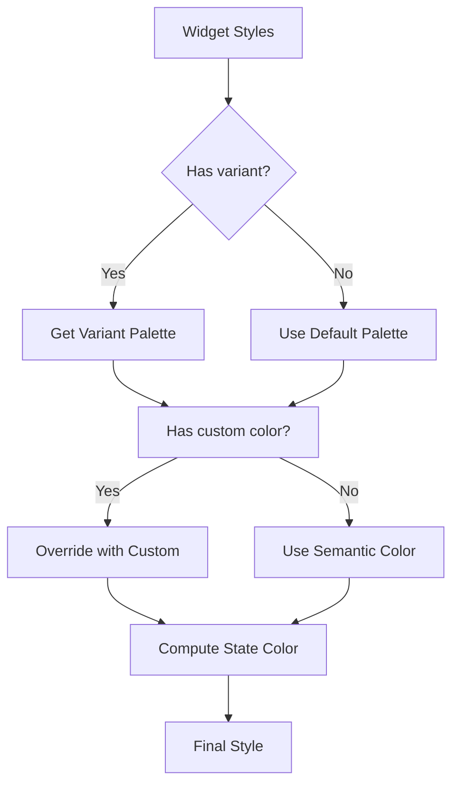

# Component Design

This guide covers the design principles and patterns used throughout DesktopUi components.

## Table of Contents
1. [Design Principles](#design-principles)
2. [Widget Component Pattern](#widget-component-pattern)
3. [Layout Components](#layout-components)
4. [State Management](#state-management)
5. [Event Handling](#event-handling)
6. [Styling System](#styling-system)

## Design Principles

### Core Principles



### 1. Separation of Concerns

Each component has a single, well-defined responsibility:

| Component | Responsibility |
|-----------|---------------|
| `Widget` | Data structure for widget definitions |
| `Runtime` | Screen lifecycle and state management |
| `Realization` | Layout computation and viewport management |
| `Renderer` | IUR to native widget translation |
| `RenderPlan` | Draw operation generation |
| `FrameEncoder` | Protocol encoding for native host |

### 2. Declarative API

Widgets are declared as data, not constructed imperatively:

```elixir
# Declarative (preferred)
Widgets.column("root", [],
  children: [
    Widgets.text("title", "Hello"),
    Widgets.button("btn", "Click")
  ]
)

# Not imperative (avoid)
# root = Column.new()
# root.add(Text.new("Hello"))
# root.add(Button.new("Click"))
```

### 3. Explicit Data Flow

Data flows in one direction through explicit bindings:



## Widget Component Pattern

### Widget Structure

All widgets follow the `DesktopUi.Widget.t()` type:



### Widget Builder Pattern

Widget builders provide a consistent API:

```elixir
defmodule DesktopUi.Widgets.Button do
  @spec button(String.t() | atom(), String.t(), keyword()) :: Widget.t()
  def button(id, label, opts \\ []) do
    Widget.new(:button,
      id: id,
      metadata: metadata(opts, focusable: true, role: :button),
      state: state(opts),
      attributes: %{
        label: label,
        icon: Keyword.get(opts, :icon)
      },
      events: events(
        click: Keyword.get(opts, :on_click, %{intent: :activate})
      ),
      styles: styles(opts)
    )
  end

  defp metadata(opts, defaults), do: # ...
  defp state(opts), do: # ...
  defp events(opts), do: # ...
  defp styles(opts), do: # ...
end
```

### Widget Families

Widgets are organized into families by purpose:



## Layout Components

### Layout Hierarchy



### Layout Algorithm

1. **Tree Construction**: Build widget tree from screen definition
2. **Bounds Computation**: Calculate preferred sizes for each widget
3. **Layout Assignment**: Assign final positions and sizes
4. **Viewport Calculation**: Determine visible regions

```elixir
# Layout example
Widgets.column("main", [],
  gap: 16,
  children: [
    Widgets.row("header", [],
      justify: :space_between,
      children: [
        Widgets.text("title", "My App"),
        Widgets.button("settings", "Settings")
      ]
    ),
    Widgets.content("content", [],
      children: [
        Widgets.table("data", columns, rows)
      ]
    )
  ]
)
```

## State Management

### State Sources



### Binding Declaration

```elixir
# Value binding
Widgets.text_input("username",
  binding: {:form, :username}
)

# Selection binding
Widgets.select("role",
  options: roles,
  binding: {:user, :role_id}
)

# Expansion binding
Widgets.tree_view("tree",
  nodes: items,
  expansion_binding: {:ui, :expanded_nodes}
)
```

### State Update Flow

```elixir
# Initial state
state = %{
  users: [%{id: 1, name: "Alice"}],
  selected_user_id: nil
}

# Widget with binding
Widgets.list("users",
  items: state.users,
  binding: {:selected_user_id}
)

# When user clicks item
# Event: %{type: :selection_changed, widget_id: "users", value: 1}

# Runtime updates bindings
# New state: %{selected_user_id: 1}
# Widget re-renders with item 1 selected
```

## Event Handling

### Event Types



### Event Declaration

```elixir
# Widget with events
Widgets.button("submit", "Save",
  on_click: %{intent: :save_form, target: :my_form}
)

# Event handler receives
%{
  type: :click,
  widget_id: "submit",
  intent: :save_form,
  target: :my_form,
  pointer: %{x: 100, y: 50}
}
```

### Event Propagation



## Styling System

### Style Categories



### Style Application

```elixir
# Semantic styles
Widgets.button("primary", "Save",
  styles: %{variant: :primary}
)

# Custom colors
Widgets.button("custom", "Save",
  styles: %{
    bg: "#3b82f6",
    fg: "#ffffff",
    border: "#1d4ed8"
  }
)

# Combined
Widgets.button("styled", "Save",
  styles: %{
    variant: :primary,
    size: :lg,
    bg: "#3b82f6"
  }
)
```

### Style Resolution



## Related Guides

- [Architecture Overview](./architecture-overview.md)
- [Widget System](./widget-system.md)
- [Runtime Backbone](./runtime-backbone.md)
- [SDL3 Integration](./sdl3-integration.md)
