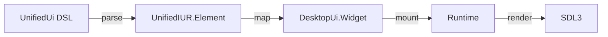
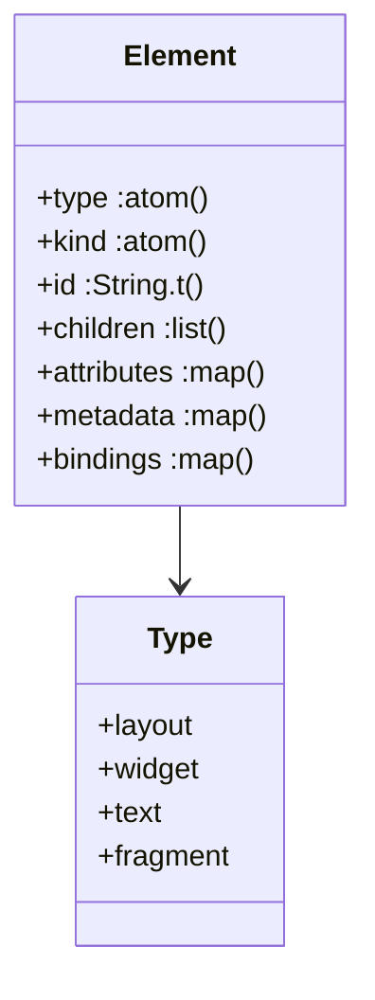
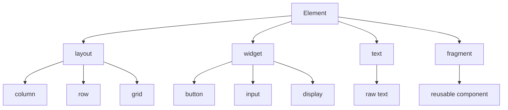
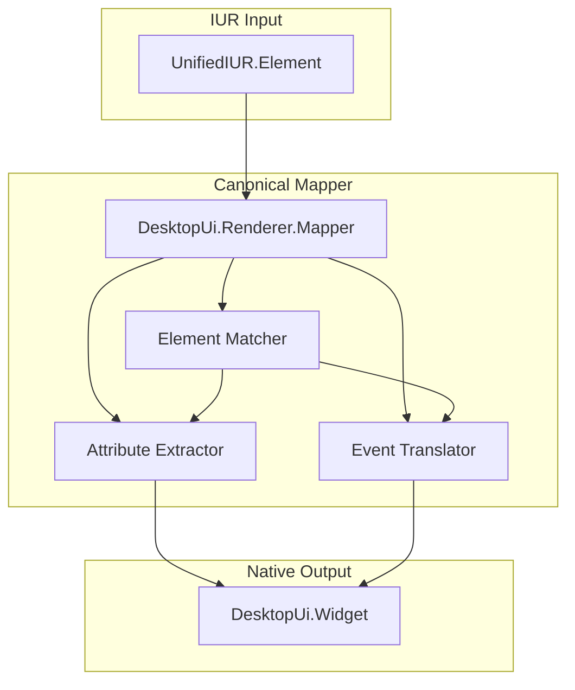
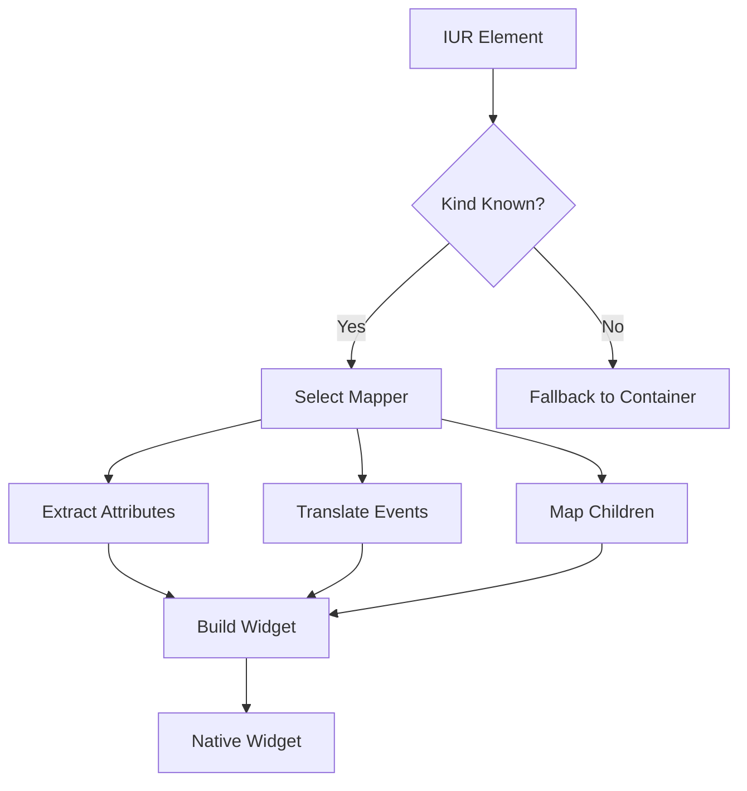
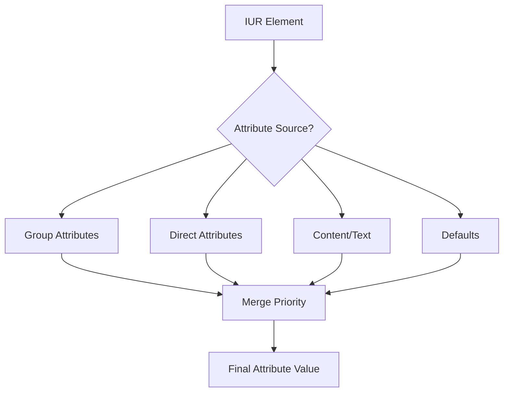
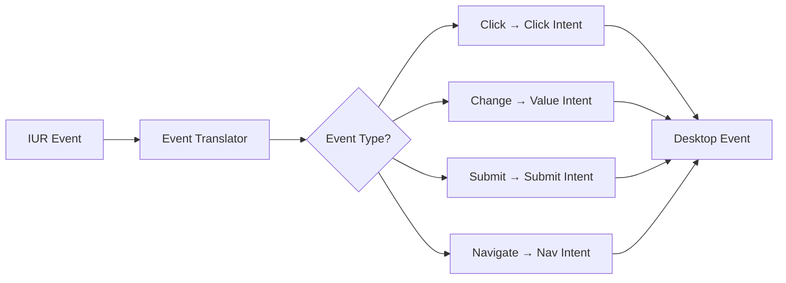
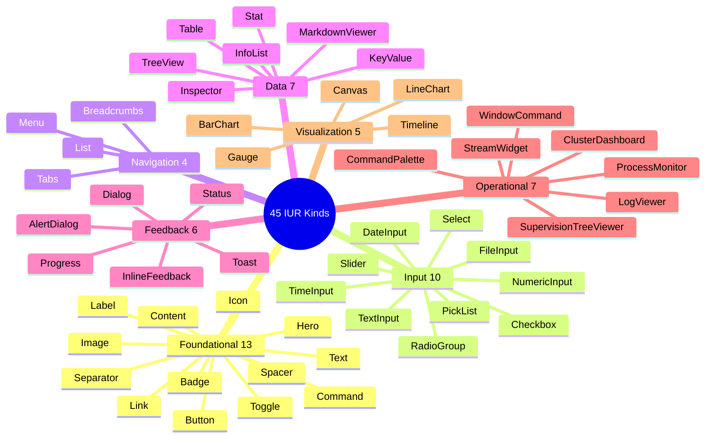

# IUR Renderer Architecture

This guide covers the canonical IUR (Intermediate Unified Representation) renderer that enables cross-runtime compatibility.

## Table of Contents
1. [Overview](#overview)
2. [IUR Specification](#iur-specification)
3. [Mapping Layer](#mapping-layer)
4. [Attribute Translation](#attribute-translation)
5. [Event Mapping](#event-mapping)
6. [Widget Coverage](#widget-coverage)

## Overview

The IUR renderer provides a canonical path from UnifiedUi DSL to native desktop widgets, enabling the same screen definitions to work across different runtimes (desktop_ui, live_ui, etc.).



### Why IUR?

- **Cross-runtime compatibility**: Same screen definition works everywhere
- **Canonical representation**: Single source of truth for UI structure
- **Separation of concerns**: DSL authoring separated from runtime behavior
- **Extensibility**: New runtimes can implement the same IUR contract

## IUR Specification

### Element Structure



### Element Types



### Element Example

```elixir
%UnifiedIUR.Element{
  type: :widget,
  kind: :button,
  id: "submit-btn",
  attributes: %{
    "label" => "Submit",
    "variant" => "primary"
  },
  metadata: %{
    "focusable" => true,
    "role" => "button"
  },
  events: %{
    "click" => %{
      "intent" => "submit_form"
    }
  }
}
```

## Mapping Layer

### Mapper Architecture



### Mapping Process



### Mapper Implementation

```elixir
defmodule DesktopUi.Renderer.Mapper do
  @spec map(UnifiedIUR.Element.t()) :: {:ok, DesktopUi.Widget.t()} | {:error, term()}
  def map(%Element{type: :widget, kind: kind} = element) do
    case kind do
      kind when kind in [:button, "button"] ->
        map_button(element)

      kind when kind in [:text_input, "text_input"] ->
        map_text_input(element)

      kind when kind in [:column, "column"] ->
        map_layout(element)

      _other ->
        map_fallback(element)
    end
  end

  defp map_button(element) do
    {:ok,
     DesktopUi.Widgets.button(
       element.id,
       attr(element, :label),
       Keyword.merge(
         base_opts(element),
         variant: attr(element, :variant)
       )
     )}
  end
end
```

## Attribute Translation

### Attribute Sources

Attributes are extracted from multiple sources in priority order:



### Attribute Extraction Helper

```elixir
defp attr(element, key, default \\ nil)

# Priority order:
# 1. Group-specific attribute (e.g., group_attr(element, :button, :variant))
# 2. Direct attribute on element
# 3. Special content attributes (:content, :text, :label)
# 4. Default value

# Example:
attr(element, :label)           # Direct "label" attribute
attr(element, :variant)         # Direct "variant" attribute
attr(element, :placeholder)     # Direct "placeholder" attribute
```

### Common Attribute Mappings

| IUR Attribute | Widget Attribute | Notes |
|---------------|------------------|-------|
| `label` | `attributes.label` | Button, checkbox, etc. |
| `content` | `attributes.content` | Text, badge |
| `value` | `state.value` | Input, slider |
| `checked` | `state.checked` | Checkbox, toggle |
| `disabled` | `state.disabled` | All widgets |
| `variant` | `attributes.variant` | Style variant |
| `size` | `attributes.size` | Widget size |
| `placeholder` | `attributes.placeholder` | Input fields |

## Event Mapping

### Event Translation



### Event Mapping Table

| IUR Event | Desktop Event | Intent |
|-----------|---------------|--------|
| `click` | `events.click` | `intent: :activate` |
| `change` | `events.change` | `intent: :change_value` |
| `submit` | `events.submit` | `intent: :submit_form` |
| `navigate` | `events.navigate` | `intent: :navigate_to` |
| `close` | `events.close` | `intent: :close` |
| `select` | `events.selection` | `intent: :select_item` |

### Event Implementation

```elixir
defp map_events(element) do
  events =
    [:click, :change, :submit, :navigate, :close]
    |> Enum.map(fn event_name ->
      case attr(element, event_name) do
        nil -> nil
        event_config when is_map(event_config) -> {event_name, event_config}
        true -> {event_name, default_intent(event_name)}
        false -> nil
      end
    end)
    |> Enum.reject(&is_nil/1)
    |> Map.new()

  Map.put(events, :click, Map.get(events, :click, %{intent: :activate}))
end
```

## Widget Coverage

### Supported Widget Kinds

The canonical mapper supports all 45 IUR widget kinds:



### Coverage Verification

```elixir
# Check if a widget kind is supported
DesktopUi.Renderer.supported_kinds()
|> Enum.member?(:button)
# => true

# Get all supported kinds
DesktopUi.Renderer.supported_kinds()
|> length()
# => 56 (45 IUR + structural kinds)

# Verify coverage
DesktopUi.Validate.example_coverage()
|> Map.get(:checks)
|> Enum.find(fn %{name: name} -> name == :renderer_supports_all_iur_kinds end)
```

## Related Guides

- [Architecture Overview](./architecture-overview.md)
- [Component Design](./component-design.md)
- [Widget System](./widget-system.md)
