# SDL3 Integration

This guide covers how DesktopUi integrates with SDL3 for native window management, rendering, and input handling.

## Table of Contents
1. [Overview](#overview)
2. [Architecture](#architecture)
3. [Protocol](#protocol)
4. [Draw Operations](#draw-operations)
5. [Event Handling](#event-handling)
6. [Resource Management](#resource-management)

## Overview

DesktopUi uses SDL3 as its primary rendering and input backend. The integration follows a **port-driver pattern** where the Elixir runtime communicates with a native SDL3 host process.

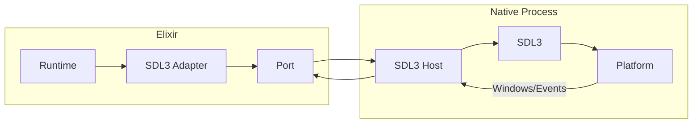

### Why SDL3?

- **Cross-platform**: Single codebase for Windows, macOS, and Linux
- **Modern API**: SDL3 provides improved APIs over SDL2
- **Hardware acceleration**: GPU-accelerated rendering
- **Input handling**: Comprehensive keyboard, mouse, and touch support
- **Audio support**: Built-in audio capabilities (future use)

## Architecture

### Component Layers

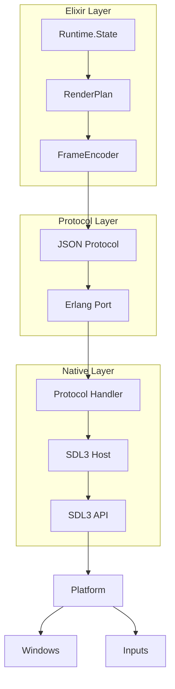

### Communication Flow

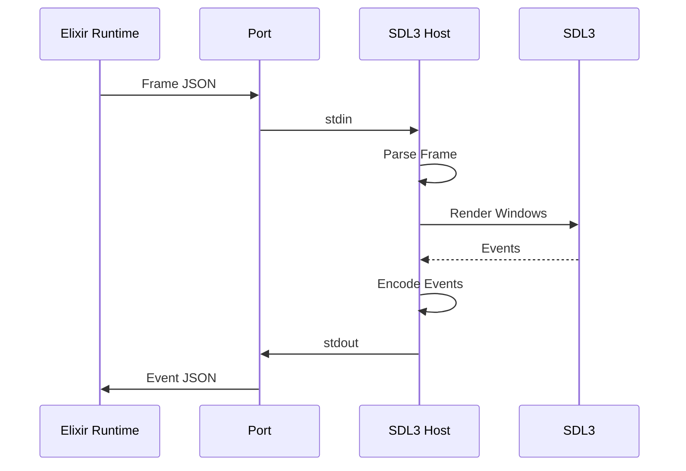

## Protocol

### Message Format

All messages are JSON-encoded with a `type` field:

```elixir
# Frame message (Elixir → Native)
%{
  "type" => "frame",
  "frame_id" => "frame-123",
  "windows" => [%{
    "window_id" => "main",
    "title" => "My App",
    "draw_operations" => [...]
  }]
}

# Event message (Native → Elixir)
%{
  "type" => "pointer_button",
  "window_id" => "main",
  "widget_id" => "btn-1",
  "button" => "left",
  "pointer" => %{"x" => 100, "y" => 50}
}
```

### Message Types

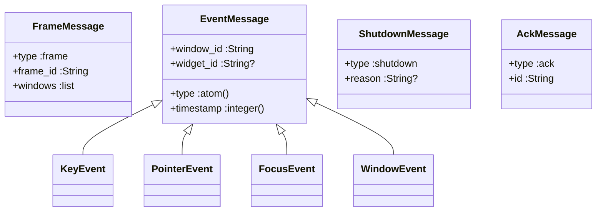

### Draw Operation Protocol

Each draw operation contains rendering instructions:

```json
{
  "widget_id": "btn-1",
  "draw_kind": "button_control",
  "kind": "button",
  "family": "action",
  "x": 10,
  "y": 10,
  "width": 200,
  "height": 40,
  "bg": "primary",
  "fg": "light",
  "content": "Click Me",
  "focusable": true,
  "focused": false,
  "disabled": false,
  "interaction": {
    "click_intent": "activate"
  }
}
```

## Draw Operations

### Draw Kind Hierarchy

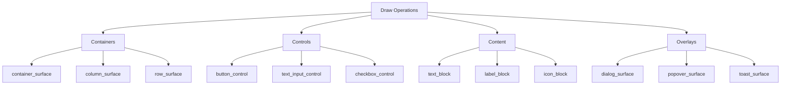

### Draw Operation Structure

```c
typedef struct {
  char window_id[128];
  char widget_id[128];
  char draw_kind[64];
  char kind[64];
  char family[64];

  // Position and size
  int x, y, width, height;

  // Clipping
  int clip;
  int clip_x, clip_y, clip_width, clip_height;

  // Styling
  char bg[64];
  char fg[64];
  char border[64];
  char variant[64];

  // Content
  char content[256];
  char image_source[256];

  // State
  int focusable, disabled, focused, selected;
  int checked, active, open;
  int value, current, selected_index;

  // Interaction
  char click_intent[64];
  char shortcut_intent[64];
  char selection_intent[64];
} dui_draw;
```

### Rendering Pipeline

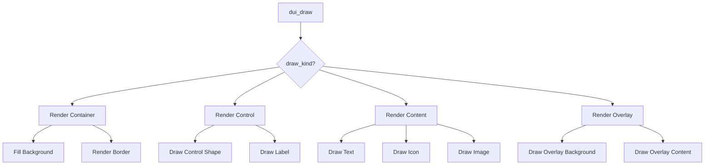

### Color System

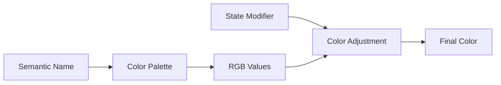

```c
// Semantic color names
dui_color named_color(const char *name, Uint8 alpha) {
  if (strcmp(name, "primary") == 0) return (dui_color){59, 130, 246, alpha};
  if (strcmp(name, "success") == 0) return (dui_color){34, 197, 94, alpha};
  if (strcmp(name, "warning") == 0) return (dui_color){234, 179, 8, alpha};
  if (strcmp(name, "error") == 0) return (dui_color){239, 68, 68, alpha};
  // ... more colors
}
```

## Event Handling

### Event Flow

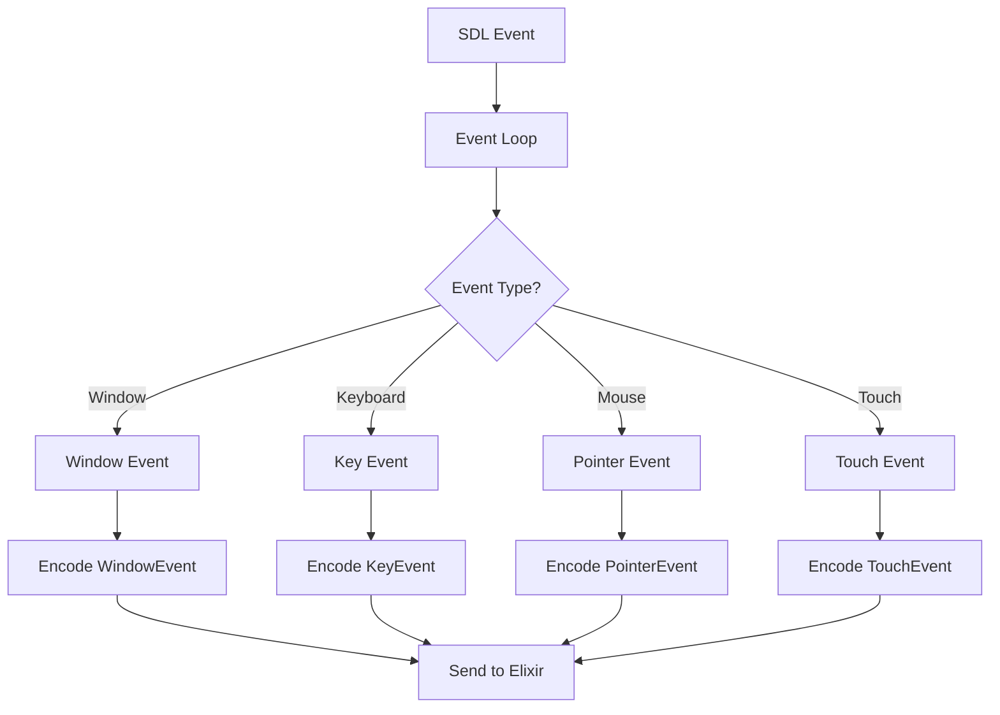

### Event Encoding

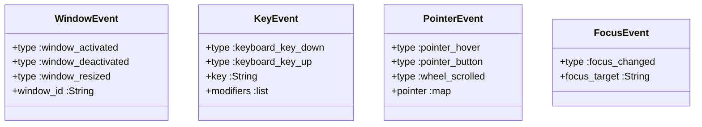

### Hit Testing

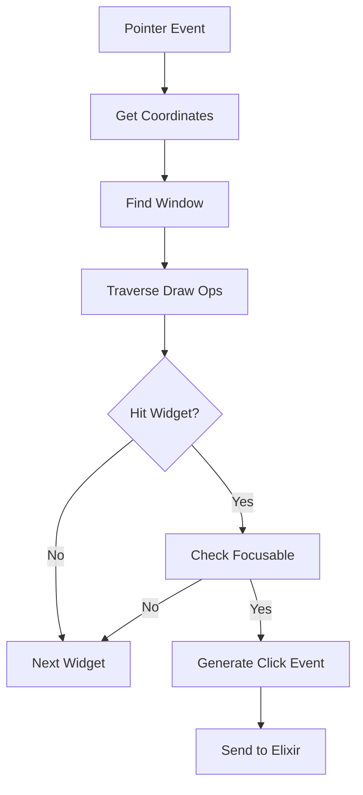

```c
dui_draw *hit_test_draw(dui_frame *frame, const char *window_id, int x, int y) {
  for (int i = frame->draw_count - 1; i >= 0; i--) {
    dui_draw *draw = &frame->draws[i];
    if (strcmp(draw->window_id, window_id) != 0) continue;

    if (x >= draw->x && x <= draw->x + draw->width &&
        y >= draw->y && y <= draw->y + draw->height) {
      return draw;
    }
  }
  return NULL;
}
```

## Resource Management

### Text Rendering

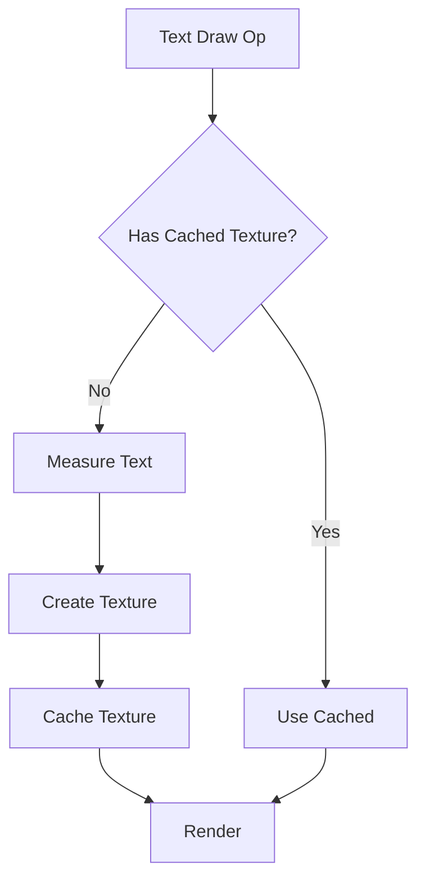

```c
typedef struct {
  char key[768];
  int width, height;
  SDL_Texture *texture;
} dui_text_cache_entry;
```

### Image Loading

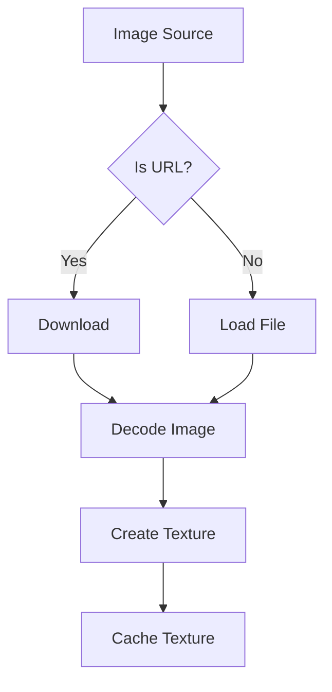

```c
typedef struct {
  char source[512];
  int width, height;
  SDL_Texture *texture;
} dui_image_cache_entry;
```

### Resource Lifecycle

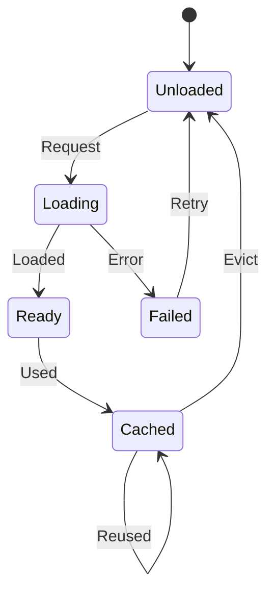

## SDL3 Lifecycle

### Application Callbacks

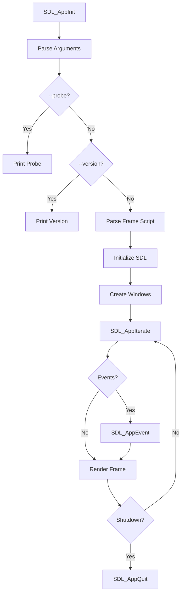

### Window Management

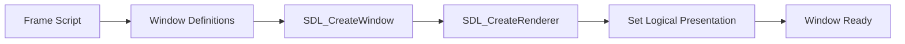

## Related Guides

- [Architecture Overview](./architecture-overview.md)
- [Component Design](./component-design.md)
- [Runtime Backbone](./runtime-backbone.md)
- [Widget System](./widget-system.md)
