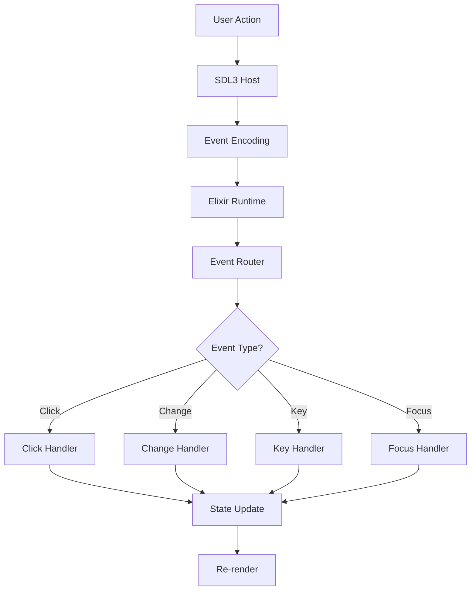

# Events & Interactions

This guide covers how to handle user interactions and events in DesktopUi applications.

## Table of Contents
1. [Event System](#event-system)
2. [Click Events](#click-events)
3. [Input Events](#input-events)
4. [Keyboard Events](#keyboard-events)
5. [Focus Management](#focus-management)
6. [State Updates](#state-updates)

## Event System

### Event Flow



### Event Structure

All events follow a common structure:

```elixir
%{
  type: :click,              # Event type
  widget_id: "button-1",     # Source widget
  window_id: "main",         # Source window
  timestamp: DateTime.now(), # When it happened
  # Event-specific fields
  pointer: %{x: 100, y: 50}  # Mouse position
}
```

## Click Events

### Basic Click Handler

```elixir
Widgets.button("click-me", "Click Me",
  on_click: fn event ->
    IO.puts("Clicked: #{event.widget_id}")
    :ok
  end
)
```

### Click with Data

```elixir
Widgets.button("save", "Save",
  on_click: fn event ->
    MyApp.Actions.save_form(form_id: event.metadata.form_id)
  end
)
```

### Click Intents

For common actions, use intents:

```elixir
Widgets.button("close", "Close",
  on_click: %{intent: :close_dialog}
)

Widgets.button("submit", "Submit",
  on_click: %{intent: :submit_form}
)
```

### Context-aware Clicks

```elixir
Widgets.button("delete", "Delete",
  on_click: fn %{widget_id: id} ->
    # Extract data from widget ID
    [_, item_id] = String.split(id, "-")
    MyApp.Items.delete(item_id)
  end
)
```

## Input Events

### Change Events

```elixir
Widgets.text_input("search",
  placeholder: "Search...",
  on_change: fn %{value: text} ->
    MyApp.Search.perform(text)
  end
)
```

### Numeric Change

```elixir
Widgets.numeric_input("quantity",
  value: 1,
  on_change: fn %{value: num} ->
    MyApp.Cart.update_quantity(num)
  end
)
```

### Slider Change

```elixir
Widgets.slider("volume",
  value: 75,
  on_change: fn %{value: level} ->
    MyApp.Audio.set_volume(level)
  end
)
```

### Select Events

```elixir
Widgets.select("role",
  options: roles,
  on_select: fn %{selected: role_id} ->
    MyApp.Users.set_role(role_id)
  end
)
```

### Toggle Events

```elixir
Widgets.toggle("notifications", "Enable",
  on_change: fn %{checked: enabled} ->
    MyApp.Settings.set_notifications(enabled)
  end
)
```

## Keyboard Events

### Keyboard Shortcuts

```elixir
Widgets.button("save", "Save",
  shortcut: "Cmd+S",
  on_click: %{intent: :save}
)
```

### Global Keyboard Handlers

```elixir
# At the screen level
screen = %{
  id: "my-screen",
  title: "My App",
  root: Widgets.column("root", [],
    children: [
      content...
    ]
  ),
  # Global keyboard handlers
  key_handlers: %{
    "?": fn -> MyApp.Help.show() end,
    "Cmd+N": fn -> MyApp.New.create() end,
    "Cmd+Q": fn -> MyApp.Quit.confirm() end
  }
}
```

### Key Combinations

```elixir
# Single key
Widgets.button("help", "Help",
  shortcut: "?",
  on_click: %{intent: :show_help}
)

# Modifier combinations
Widgets.button("save", "Save",
  shortcut: "Cmd+S",
  on_click: %{intent: :save}
)

Widgets.button("undo", "Undo",
  shortcut: "Cmd+Z",
  on_click: %{intent: :undo}
)
```

## Focus Management

### Focusable Widgets

```elixir
# All these widgets are focusable by default:
Widgets.button("btn", "Button")
Widgets.text_input("input", "")
Widgets.select("select", [], options: [])
Widgets.checkbox("check", "Label", checked: false)
Widgets.toggle("toggle", "Label")
```

### Focus Navigation

```elixir
# Tab order follows widget definition order
Widgets.column("form", [],
  children: [
    Widgets.text_input("field1", ""),  # Tab index 0
    Widgets.text_input("field2", ""),  # Tab index 1
    Widgets.button("submit", "Submit")  # Tab index 2
  ]
)
```

### Programmatic Focus

```elixir
# Set initial focus
screen = %{
  id: "my-screen",
  title: "My App",
  root: layout(),
  initial_focus: "search-input"
}
```

### Focus Events

```elixir
Widgets.text_input("search",
  placeholder: "Search...",
  on_focus: fn ->
    IO.puts("Search focused")
  end,
  on_blur: fn ->
    IO.puts("Search lost focus")
  end
)
```

## State Updates

### Binding-Based Updates

```elixir
defmodule MyApp.Screens.Counter do
  alias DesktopUi.Widgets

  def screen do
    %{
      id: "counter",
      title: "Counter",
      root: layout(),
      bindings: %{
        count: %{
          name: :count,
          value: 0,
          on_change: &update_count/2
        }
      }
    }
  end

  defp layout do
    Widgets.column("layout", [],
      gap: 16,
      children: [
        Widgets.text("display", "Count: 0",
          binding: {:count, :display_value}
        ),
        Widgets.row("buttons", [],
          gap: 8,
          children: [
            Widgets.button("decrement", "-",
              on_click: %{intent: :decrement}
            ),
            Widgets.button("increment", "+",
              on_click: %{intent: :increment}
            )
          ]
        )
      ]
    )
  end

  defp update_count(:count, new_value) do
    IO.puts("Count is now: #{new_value}")
    {:ok, new_value}
  end
end
```

### Event Handler State

```elixir
defmodule MyApp.Screens.TodoList do
  alias DesktopUi.Widgets

  def screen do
    %{
      id: "todos",
      title: "Todo List",
      root: layout(todos())
    }
  end

  defp layout(todos) do
    Widgets.column("layout", [],
      gap: 16,
      children: [
        new_todo_input(),
        todo_list(todos)
      ]
    )
  end

  defp new_todo_input do
    Widgets.row("input", [],
      gap: 8,
      children: [
        Widgets.text_input("new",
          placeholder: "New todo...",
          on_change: fn %{value: text} ->
            # Update local state
            {:ok, %{pending: text}}
          end,
          on_submit: fn %{value: text} ->
            MyApp.Todos.add(text)
          end
        ),
        Widgets.button("add", "Add",
          on_click: fn ->
            text = get_pending_value()
            MyApp.Todos.add(text)
          end
        )
      ]
    )
  end

  defp todo_list(todos) do
    Widgets.list("todos",
      items: Enum.map(todos, fn todo ->
        %{
          id: todo.id,
          label: todo.title,
          checked: todo.completed
        }
      end),
      on_select: fn %{selected: todo_id} ->
        MyApp.Todos.toggle(todo_id)
      end
    )
  end
end
```

## Common Interaction Patterns

### Form Submission

```elixir
defp submit_button do
  Widgets.button("submit", "Submit",
    on_click: fn event ->
      with {:ok, form_data} <- gather_form_data(event.window_id),
           {:ok, _result} <- MyApp.API.submit(form_data) do
        :ok
      else
        {:error, reason} ->
          show_error(reason)
      end
    end
  )
end
```

### Dialog Actions

```elixir
defp confirm_dialog do
  Widgets.dialog("confirm", [],
    title: "Confirm Action",
    open: true,
    children: [
      Widgets.text("msg", "Are you sure?"),
      Widgets.row("actions", [],
        gap: 8,
        children: [
          Widgets.button("cancel", "Cancel",
            on_click: %{intent: :close_dialog}
          ),
          Widgets.button("confirm", "Confirm",
            variant: :error,
            on_click: fn ->
              MyApp.DangerousAction.execute()
            end
          )
        ]
      )
    ]
  )
end
```

### List Item Actions

```elixir
defp list_item(item) do
  Widgets.row("item", [],
    gap: 12,
    children: [
      Widgets.text("name", item.name),
      Widgets.spacer("flex", []),
      Widgets.button("edit", "Edit",
        on_click: fn -> MyApp.Items.edit(item.id) end
      ),
      Widgets.button("delete", "Delete",
        variant: :secondary,
        on_click: fn -> MyApp.Items.delete(item.id) end
      )
    ]
  )
end
```

### Navigation Events

```elixir
defp nav_links do
  Widgets.column("nav", [],
    gap: 8,
    children: [
      Widgets.link("home", "Home", "/",
        on_navigate: fn -> track_page_view(:home) end
      ),
      Widgets.link("about", "About", "/about",
        on_navigate: fn -> track_page_view(:about) end
      ),
      Widgets.link("logout", "Logout", "/logout",
        on_navigate: fn ->
          MyApp.Auth.logout()
          :redirect, "/login"
        end
      )
    ]
  )
end
```

## Event Modifiers

### Debouncing

```elixir
Widgets.text_input("search",
  placeholder: "Search...",
  on_change: debounce(fn %{value: query} ->
    MyApp.Search.perform(query)
  end, 300)
)
```

### Throttling

```elixir
Widgets.slider("scroll",
  value: 50,
  on_change: throttle(fn %{value: pos} ->
    MyApp.Content.scroll_to(pos)
  end, 100)
)
```

### Prevent Default

```elixir
Widgets.button("submit", "Submit",
  on_click: fn event ->
    # Prevent form submission if validation fails
    if valid?() do
      submit_form()
    else
      {:prevent_default, show_validation_error()}
    end
  end
)
```

## Quick Reference

| Event Type | Widget | Handler Signature |
|------------|--------|-------------------|
| `click` | Button, Link | `fn event -> :ok end` |
| `change` | Input, Slider, Select | `fn %{value: v} -> :ok end` |
| `select` | List, RadioGroup | `fn %{selected: id} -> :ok end` |
| `submit` | Form, Input | `fn event -> :ok end` |
| `focus` | Focusable | `fn -> :ok end` |
| `blur` | Focusable | `fn -> :ok end` |

## Next Steps

- [Getting Started](./getting-started.md) - Setup and basics
- [Input & Forms](./input-forms.md) - Form widgets
- [Layout & Composition](./layout-composition.md) - Building layouts
