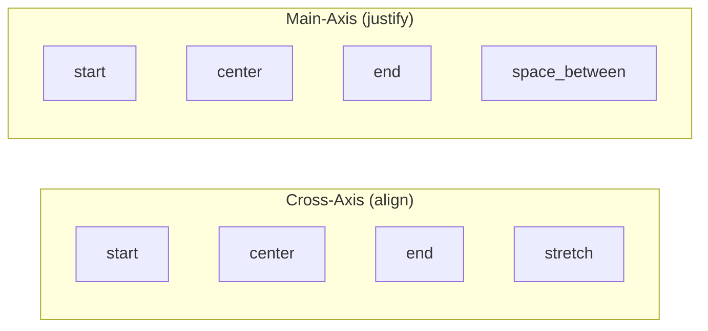

# Layout & Composition

This guide covers how to compose complex layouts using DesktopUi's layout widgets.

## Table of Contents
1. [Layout Fundamentals](#layout-fundamentals)
2. [Column Layout](#column-layout)
3. [Row Layout](#row-layout)
4. [Grid & Stack Layouts](#grid--stack-layouts)
5. [Advanced Composition](#advanced-composition)
6. [Responsive Layouts](#responsive-layouts)

## Layout Fundamentals

### Layout Widget Properties

All layout widgets share common properties:

```elixir
Widgets.column("id", children,
  gap: 16,              # Spacing between children
  align: :start,        # Cross-axis alignment
  justify: :start,      # Main-axis alignment
  padding: 16,          # Inner padding
  styles: %{}           # Additional styles
)
```

### Gap Options

```elixir
# Size variants
gap: :xs   # 4px
gap: :sm   # 8px
gap: :md   # 16px (default)
gap: :lg   # 24px
gap: :xl   # 32px

# Custom pixel value
gap: 12
```

### Alignment Options



## Column Layout

Vertical stacking of children:

```elixir
Widgets.column("sidebar", [],
  gap: 8,
  children: [
    Widgets.text("logo", "MyApp"),
    Widgets.separator("sep"),
    Widgets.link("home", "Home", "/"),
    Widgets.link("docs", "Docs", "/"),
    Widgets.link("settings", "Settings", "/")
  ]
)
```

### Column Alignment

```elixir
# Align items horizontally
Widgets.column("form", [],
  gap: 16,
  align: :start,     # Left align
  children: [
    Widgets.text("label", "Left aligned")
  ]
)

Widgets.column("form", [],
  gap: 16,
  align: :center,    # Center align
  children: [
    Widgets.text("label", "Centered")
  ]
)

Widgets.column("form", [],
  gap: 16,
  align: :stretch,   # Full width
  children: [
    Widgets.button("btn", "Full Width Button")
  ]
)
```

### Column Justification

```elixir
Widgets.column("panel", [],
  gap: 8,
  justify: :start,        # Top align
  children: [...]
)

Widgets.column("panel", [],
  gap: 8,
  justify: :center,      # Center vertically
  children: [...]
)

Widgets.column("panel", [],
  gap: 8,
  justify: :end,        # Bottom align
  children: [...]
)

Widgets.column("panel", [],
  gap: 8,
  justify: :space_between,  # Even spacing
  children: [...]
)
```

## Row Layout

Horizontal arrangement of children:

```elixir
Widgets.row("toolbar", [],
  gap: 8,
  children: [
    Widgets.button("save", "Save"),
    Widgets.button("cancel", "Cancel"),
    Widgets.spacer("flex", []),
    Widgets.button("help", "?")
  ]
)
```

### Row Alignment

```elixir
# Align items vertically
Widgets.row("nav", [],
  gap: 16,
  align: :start,     # Top align
  children: [
    Widgets.text("title", "Title"),
    Widgets.button("btn", "Btn")
  ]
)

Widgets.row("nav", [],
  gap: 16,
  align: :center,    # Middle align
  children: [
    Widgets.text("title", "Title"),
    Widgets.button("btn", "Btn")
  ]
)
```

### Row Justification

```elixir
Widgets.row("header", [],
  gap: 8,
  justify: :start,        # Left align
  children: [...]
)

Widgets.row("header", [],
  gap: 8,
  justify: :center,       # Center horizontally
  children: [...]
)

Widgets.row("header", [],
  gap: 8,
  justify: :space_between,  # Space out items
  children: [
    Widgets.text("title", "Title"),
    Widgets.button("btn", "Btn")
  ]
)
```

## Grid & Stack Layouts

### Using Columns for Grids

Create grid-like layouts with nested columns:

```elixir
Widgets.column("grid", [],
  gap: 16,
  children: [
    # Row 1
    Widgets.row("row-1", [],
      gap: 16,
      children: [
        Widgets.card("card-1", []),
        Widgets.card("card-2", []),
        Widgets.card("card-3", [])
      ]
    ),
    # Row 2
    Widgets.row("row-2", [],
      gap: 16,
      children: [
        Widgets.card("card-4", []),
        Widgets.card("card-5", [])
      ]
    )
  ]
)
```

### Stack Layout

Layer widgets on top of each other:

```elixir
Widgets.stack("overlay", [],
  children: [
    # Main content
    Widgets.content("main", [],
      children: [
        Widgets.text("title", "Content")
      ]
    ),
    # Overlay dialog
    Widgets.dialog("confirm", [],
      title: "Confirm",
      open: true,
      children: [
        Widgets.text("msg", "Are you sure?")
      ]
    )
  ]
)
```

## Advanced Composition

### Window Structure

```elixir
defmodule MyApp.Screens.Dashboard do
  alias DesktopUi.Widgets

  def screen do
    %{
      id: "dashboard",
      title: "Dashboard - MyApp",
      root: window_layout()
    }
  end

  defp window_layout do
    Widgets.column("root", [],
      gap: 0,
      children: [
        toolbar(),
        Widgets.separator("sep"),
        main_content()
      ]
    )
  end

  defp toolbar do
    Widgets.row("toolbar", [],
      gap: 16,
      padding: 12,
      styles: %{bg: "muted"},
      justify: :space_between,
      children: [
        Widgets.text("title", "Dashboard"),
        Widgets.row("actions", [],
          gap: 8,
          children: [
            Widgets.button("refresh", "Refresh"),
            Widgets.button("settings", "", icon: :gear)
          ]
        )
      ]
    )
  end

  defp main_content do
    Widgets.row("content", [],
      children: [
        sidebar(),
        Widgets.separator("vsep", orientation: :vertical),
        main_panel()
      ]
    )
  end

  defp sidebar do
    Widgets.column("sidebar", [],
      gap: 8,
      padding: 16,
      width: 200,
      children: [
        Widgets.text("heading", "Navigation"),
        Widgets.link("dash", "Dashboard", "/"),
        Widgets.link("users", "Users", "/users"),
        Widgets.link("reports", "Reports", "/reports")
      ]
    )
  end

  defp main_panel do
    Widgets.column("panel", [],
      gap: 16,
      padding: 24,
      children: [
        Widgets.text("page-title", "Dashboard"),
        Widgets.stat("stat1", value: 1234, label: "Users"),
        Widgets.table("data", columns, rows)
      ]
    )
  end
end
```

### Scrollable Content

```elixir
Widgets.content("scrollable", [],
  styles: %{overflow: :scroll},
  children: [
    Widgets.column("content", [],
      gap: 8,
      children: long_list()
    )
  ]
)
```

### Split Pane Layout

```elixir
Widgets.row("split", [],
  children: [
    Widgets.column("left", [],
      width: 300,
      children: [
        Widgets.text("title", "Sidebar")
      ]
    ),
    # Resizable divider
    Widgets.separator("resize", orientation: :vertical),
    Widgets.column("right", [],
      children: [
        Widgets.text("title", "Main Content")
      ]
    )
  ]
)
```

## Responsive Layouts

### Adaptive Layouts

```elixir
defp responsive_layout(width) do
  if width < 768 do
    # Mobile: single column
    mobile_layout()
  else
    # Desktop: multi-column
    desktop_layout()
  end
end

defp mobile_layout do
  Widgets.column("mobile", [],
    gap: 16,
    children: [
      header(),
      navigation(),
      content()
    ]
  )
end

defp desktop_layout do
  Widgets.row("desktop", [],
    children: [
      sidebar(),
      main_content()
    ]
  )
end
```

### Constrained Widths

```elixir
Widgets.column("container", [],
  gap: 16,
  styles: %{max_width: 1200},
  children: [
    header(),
    content()
  ]
)
```

## Common Layout Patterns

### Card Layout

```elixir
defp card(title, content) do
  Widgets.content("card", [],
    styles: %{
      bg: "canvas",
      border: "muted"
    },
    children: [
      Widgets.text("title", title,
        styles: %{size: :lg, weight: :semibold}
      ),
      Widgets.separator("sep"),
      content
    ]
  )
end
```

### List Item Layout

```elixir
defp list_item(icon, title, subtitle) do
  Widgets.row("item", [],
    gap: 12,
    align: :center,
    children: [
      Widgets.icon("icon", icon),
      Widgets.column("text", [],
        gap: 4,
        children: [
          Widgets.text("title", title),
          Widgets.text("subtitle", subtitle,
            styles: %{variant: "muted"}
          )
        ]
      )
    ]
  )
end
```

### Form Layout

```elixir
defp form_field(label, input_widget) do
  Widgets.column("field", [],
    gap: 8,
    children: [
      Widgets.label("label", label,
        for: input_widget.id
      ),
      input_widget
    ]
  )
end

# Usage
Widgets.column("form", [],
  gap: 16,
  children: [
    form_field("Name",
      Widgets.text_input("name", placeholder: "Enter name")
    ),
    form_field("Email",
      Widgets.text_input("email", type: :email)
    ),
    Widgets.button("submit", "Submit")
  ]
)
```

## Quick Reference

| Property | Values | Description |
|----------|--------|-------------|
| `gap` | `:xs, :sm, :md, :lg, :xl` or pixels | Spacing between children |
| `align` | `:start, :center, :end, :stretch` | Cross-axis alignment |
| `justify` | `:start, :center, :end, :space_between` | Main-axis alignment |
| `padding` | Pixels or size variant | Inner padding |
| `width` | Pixels | Fixed width |
| `height` | Pixels | Fixed height |

## Next Steps

- [Input & Forms](./input-forms.md) - Building forms
- [Styling & Theming](./styling-theming.md) - Visual customization
- [Events & Interactions](./events-interactions.md) - Handle user input
