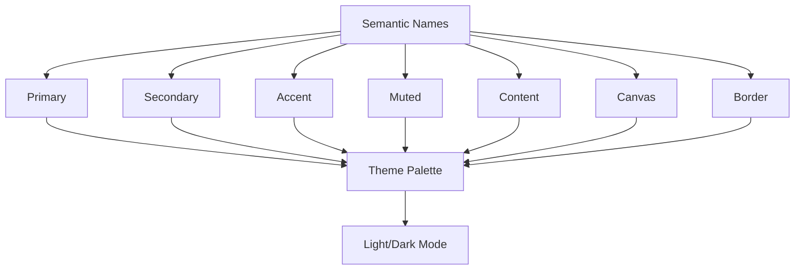

# Styling & Theming

This guide covers how to customize the appearance of your DesktopUi applications.

## Table of Contents
1. [Color System](#color-system)
2. [Typography](#typography)
3. [Widget Styling](#widget-styling)
4. [Size Variants](#size-variants)
5. [Custom Themes](#custom-themes)
6. [Dark Mode](#dark-mode)

## Color System

### Semantic Colors

DesktopUi uses a semantic color system that adapts to light/dark themes:



### Using Semantic Colors

```elixir
Widgets.button("primary", "Save",
  styles: %{variant: :primary}     # Primary brand color
)

Widgets.button("secondary", "Cancel",
  styles: %{variant: :secondary}   # Secondary color
)

Widgets.button("accent", "Highlight",
  styles: %{variant: :accent}      # Accent/highlight color
)
```

### Status Colors

```elixir
Widgets.badge("success", "Complete", variant: :success)
Widgets.badge("warning", "Pending", variant: :warning)
Widgets.badge("error", "Failed", variant: :error)
Widgets.badge("info", "Note", variant: :info)
```

### Direct Color Values

```elixir
# Hex colors
Widgets.button("custom", "Click",
  styles: %{
    bg: "#3b82f6",
    fg: "#ffffff"
  }
)

# RGB values
Widgets.button("rgb", "Click",
  styles: %{
    bg: {59, 130, 246},
    fg: {255, 255, 255}
  }
)

# RGBA values (with alpha)
Widgets.button("rgba", "Click",
  styles: %{
    bg: {59, 130, 246, 200}   # Semi-transparent
  }
)
```

## Typography

### Text Sizes

```elixir
Widgets.text("xs", "Extra Small",
  styles: %{size: :xs}
)

Widgets.text("sm", "Small",
  styles: %{size: :sm}
)

Widgets.text("md", "Medium",
  styles: %{size: :md}   # default
)

Widgets.text("lg", "Large",
  styles: %{size: :lg}
)

Widgets.text("xl", "Extra Large",
  styles: %{size: :xl}
)

Widgets.text("xxl", "2X Large",
  styles: %{size: :xxl}
)

Widgets.text("3xl", "3X Large",
  styles: %{size: :3xl}
)
```

### Text Weight

```elixir
Widgets.text("light", "Light text",
  styles: %{weight: :light}
)

Widgets.text("normal", "Normal text",
  styles: %{weight: :normal}
)

Widgets.text("semibold", "Semibold text",
  styles: %{weight: :semibold}
)

Widgets.text("bold", "Bold text",
  styles: %{weight: :bold}
)
```

### Text Alignment

```elixir
Widgets.text("left", "Left aligned",
  styles: %{align: :left}
)

Widgets.text("center", "Centered",
  styles: %{align: :center}
)

Widgets.text("right", "Right aligned",
  styles: %{align: :right}
)
```

## Widget Styling

### Common Style Properties

```elixir
# Background and foreground
Widgets.button("styled", "Button",
  styles: %{
    bg: "primary",      # Background color
    fg: "light",        # Text color
    border: "primary"   # Border color
  }
)
```

### Border Styling

```elixir
# Border width
Widgets.content("bordered", [],
  styles: %{
    border_width: 1
  }
)

# Border radius
Widgets.button("rounded", "Button",
  styles: %{
    radius: :sm          # xs, sm, md, lg, xl, :full
  }
)

# Full rounded (pill)
Widgets.button("pill", "Button",
  styles: %{
    radius: :full
  }
)
```

### Spacing Styles

```elixir
# Padding
Widgets.content("padded", [],
  styles: %{
    padding: :sm         # xs, sm, md, lg, xl
  }
)

# Custom padding
Widgets.content("padded", [],
  styles: %{
    padding: 16
  }
)

# Margin
Widgets.text("spaced", "Text",
  styles: %{
    margin: :md
  }
)
```

### Shadow and Elevation

```elixir
# Elevation levels
Widgets.card("elevated", [],
  styles: %{
    elevation: 1         # 0, 1, 2, 3, 4
  }
)

# No shadow
Widgets.card("flat", [],
  styles: %{
    elevation: 0
  }
)
```

## Size Variants

### Button Sizes

```elixir
Widgets.button("xs", "XS", size: :xs)
Widgets.button("sm", "SM", size: :sm)
Widgets.button("md", "MD", size: :md)
Widgets.button("lg", "LG", size: :lg)
Widgets.button("xl", "XL", size: :xl)
```

### Input Sizes

```elixir
Widgets.text_input("small", "", size: :sm)
Widgets.text_input("large", "", size: :lg)
```

### Icon Sizes

```elixir
Widgets.icon("small", :gear, size: :sm)
Widgets.icon("large", :gear, size: :lg)
```

## Custom Themes

### Theme Structure

```elixir
defmodule MyApp.Theme do
  def colors do
    %{
      primary: "#6366f1",
      secondary: "#64748b",
      accent: "#8b5cf6",
      success: "#22c55e",
      warning: "#f59e0b",
      error: "#ef4444",
      canvas: "#ffffff",
      content: "#1e293b",
      muted: "#64748b",
      border: "#e2e8f0"
    }
  end

  def fonts do
    %{
      family: "Inter, system-ui, sans-serif",
      code: "JetBrains Mono, monospace"
    }
  end

  def spacing do
    %{
      xs: 4,
      sm: 8,
      md: 16,
      lg: 24,
      xl: 32
    }
  end
end
```

### Applying Custom Theme

```elixir
# Apply theme colors
Widgets.button("themed", "Button",
  styles: %{
    bg: MyApp.Theme.colors().primary,
    fg: "#ffffff"
  }
)

# Create styled widgets helper
defmodule MyApp.Widgets do
  alias DesktopUi.Widgets

  def primary_button(id, label, opts \\ []) do
    Widgets.button(id, label,
      Keyword.merge(opts,
        styles: %{
          bg: MyApp.Theme.colors().primary,
          fg: "#ffffff"
        }
      )
    )
  end
end
```

### Theme Provider

```elixir
defmodule MyApp.Theme.Provider do
  def theme do
    %{
      colors: colors(),
      fonts: fonts(),
      spacing: spacing(),
      border: border(),
      shadows: shadows()
    }
  end

  def apply_styles(widget, style_overrides \\ []) do
    base_styles = %{
      bg: theme().colors.canvas,
      fg: theme().colors.content,
      border: theme().colors.border
    }

    merged_styles =
      Map.merge(base_styles, Map.new(style_overrides))

    %{widget | styles: merged_styles}
  end
end
```

## Dark Mode

### Theme Switching

```elixir
defmodule MyApp.Theme do
  def colors(:light) do
    %{
      canvas: "#ffffff",
      content: "#1e293b",
      muted: "#64748b",
      border: "#e2e8f0"
    }
  end

  def colors(:dark) do
    %{
      canvas: "#0f172a",
      content: "#f1f5f9",
      muted: "#94a3b8",
      border: "#334155"
    }
  end

  def current_theme do
    if Application.get_env(:my_app, :dark_mode, false) do
      colors(:dark)
    else
      colors(:light)
    end
  end
end
```

### Dark Mode Toggle

```elixir
defmodule MyApp.Screens.Settings do
  alias DesktopUi.Widgets

  def theme_toggle do
    Widgets.toggle("dark-mode", "Dark Mode",
      checked: dark_mode_enabled?(),
      on_change: fn %{checked: enabled} ->
        Application.put_env(:my_app, :dark_mode, enabled)
        # Trigger re-render
        :ok
      end
    )
  end

  defp dark_mode_enabled? do
    Application.get_env(:my_app, :dark_mode, false)
  end
end
```

### Adaptive Components

```elixir
defmodule MyApp.Components do
  alias DesktopUi.Widgets

  def card(id, title, content, opts \\ []) do
    styles = if dark_mode?() do
      %{
        bg: "#1e293b",
        fg: "#f1f5f9",
        border: "#334155"
      }
    else
      %{
        bg: "#ffffff",
        fg: "#1e293b",
        border: "#e2e8f0"
      }
    end

    Widgets.content(id, [],
      styles: styles,
      children: [
        Widgets.text("title", title),
        content
      ]
    )
  end

  defp dark_mode? do
    Application.get_env(:my_app, :dark_mode, false)
  end
end
```

## Style Inheritance

### Widget Style Propagation

```elixir
# Parent styles can affect children
Widgets.column("themed", [],
  styles: %{fg: "muted"},    # Children inherit muted text
  children: [
    Widgets.text("a", "Text A"),   # Will be muted
    Widgets.text("b", "Text B")    # Will be muted
  ]
)

# Override inheritance
Widgets.column("themed", [],
  styles: %{fg: "muted"},
  children: [
    Widgets.text("a", "Text A"),   # Muted
    Widgets.text("b", "Text B",     # Muted
      styles: %{fg: "primary}      # Override - primary color
    )
  ]
)
```

## Complete Theme Example

```elixir
defmodule MyApp.Theme do
  @doc """
  Complete theme definition for MyApp
  """
  def theme do
    %{
      colors: colors(),
      typography: typography(),
      spacing: spacing(),
      borders: borders(),
      shadows: shadows(),
      transitions: transitions()
    }
  end

  def colors do
    %{
      # Brand colors
      primary: "#6366f1",
      primary_hover: "#4f46e5",
      primary_active: "#4338ca",
      secondary: "#64748b",
      accent: "#8b5cf6",

      # Semantic colors
      success: "#22c55e",
      warning: "#f59e0b",
      error: "#ef4444",
      info: "#3b82f6",

      # Neutral colors (light mode)
      canvas: "#ffffff",
      content: "#0f172a",
      muted: "#64748b",
      border: "#e2e8f0",

      # Elevated surfaces
      elevated: "#f8fafc",
      overlay: "rgba(0, 0, 0, 0.5)"
    }
  end

  def dark_colors do
    %{
      # Brand colors (adjusted for dark)
      primary: "#818cf8",
      primary_hover: "#6366f1",
      primary_active: "#4f46e5",

      # Semantic colors
      success: "#4ade80",
      warning: "#fbbf24",
      error: "#f87171",
      info: "#60a5fa",

      # Neutral colors (dark mode)
      canvas: "#0f172a",
      content: "#f1f5f9",
      muted: "#94a3b8",
      border: "#334155",

      # Elevated surfaces
      elevated: "#1e293b",
      overlay: "rgba(0, 0, 0, 0.7)"
    }
  end

  def typography do
    %{
      font_family: "Inter, -apple-system, system-ui, sans-serif",
      code_family: "JetBrains Mono, monospace",

      sizes: %{
        xs: "0.75rem",     # 12px
        sm: "0.875rem",    # 14px
        base: "1rem",      # 16px
        lg: "1.125rem",    # 18px
        xl: "1.25rem",     # 20px
        "2xl": "1.5rem",   # 24px
        "3xl": "1.875rem", # 30px
        "4xl": "2.25rem"   # 36px
      },

      weights: %{
        light: 300,
        normal: 400,
        medium: 500,
        semibold: 600,
        bold: 700
      }
    }
  end

  def spacing do
    %{
      xs: 4,
      sm: 8,
      md: 16,
      lg: 24,
      xl: 32,
      "2xl": 48,
      "3xl": 64
    }
  end

  def borders do
    %{
      radius: %{
        sm: "4px",
        md: "8px",
        lg: "12px",
        xl: "16px",
        full: "9999px"
      },
      width: %{
        thin: 1,
        default: 2,
        thick: 4
      }
    }
  end

  def shadows do
    %{
      sm: "0 1px 2px 0 rgba(0, 0, 0, 0.05)",
      md: "0 4px 6px -1px rgba(0, 0, 0, 0.1)",
      lg: "0 10px 15px -3px rgba(0, 0, 0, 0.1)",
      xl: "0 20px 25px -5px rgba(0, 0, 0, 0.1)"
    }
  end

  def transitions do
    %{
      fast: "150ms",
      base: "200ms",
      slow: "300ms"
    }
  end
end
```

## Quick Reference

| Style Property | Values | Example |
|----------------|--------|---------|
| `variant` | `:primary, :secondary, :accent, :success, :warning, :error` | `variant: :primary` |
| `bg` | Color name, hex, or RGB | `bg: "#3b82f6"` |
| `fg` | Color name, hex, or RGB | `fg: "content"` |
| `border` | Color name or value | `border: "muted"` |
| `size` | `:xs, :sm, :md, :lg, :xl` | `size: :lg` |
| `weight` | `:light, :normal, :semibold, :bold` | `weight: :semibold` |
| `align` | `:left, :center, :right` | `align: :center` |
| `radius` | `:xs, :sm, :md, :lg, :xl, :full` | `radius: :md` |
| `elevation` | `0, 1, 2, 3, 4` | `elevation: 2` |

## Next Steps

- [Basic Widgets](./basic-widgets.md) - Widget styling options
- [Layout & Composition](./layout-composition.md) - Layout styling
- [Events & Interactions](./events-interactions.md) - Interactive states
