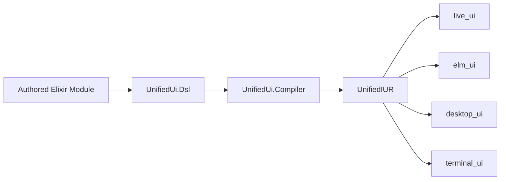
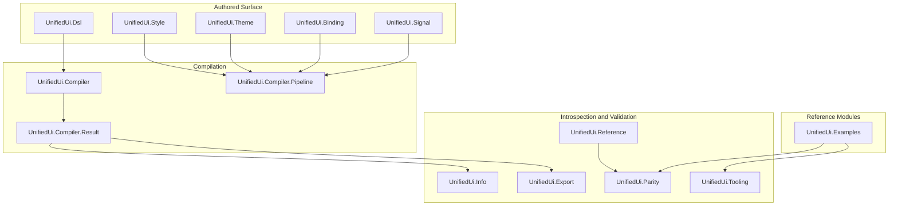

# UnifiedUi Architecture Overview

This guide explains where `UnifiedUi` sits in the unified ecosystem, what it
owns, and how its main subsystems fit together.

## Table of Contents

1. [What UnifiedUi Is](#what-unifiedui-is)
2. [Ecosystem Position](#ecosystem-position)
3. [Package Layers](#package-layers)
4. [Core Invariants](#core-invariants)
5. [Developer Entry Points](#developer-entry-points)

## What UnifiedUi Is

`UnifiedUi` is the authored UI DSL and compiler package for the ecosystem.

It exists to let developers describe UI intent once, in a renderer-independent
Elixir DSL, and then lower that authored model into canonical `UnifiedIUR`.
Runtime packages such as `live_ui`, `elm_ui`, `desktop_ui`, and `terminal_ui`
consume that canonical output.

What the package owns:

- the authored DSL surface
- canonical themes, bindings, and interaction authoring
- deterministic lowering into `UnifiedIUR`
- introspection, export, parity, and validation tooling

What the package does not own:

- renderer-specific widget trees
- Phoenix, Elm, SDL3, or terminal runtime behavior
- long-lived runtime services or event loops

## Ecosystem Position

`UnifiedUi` is the single authored boundary. The downstream runtime packages are
renderers and native libraries, not alternative authoring systems.

The practical consequence is simple: if a concept only makes sense inside one
runtime, it should usually stay out of `UnifiedUi`.

## Package Layers

The package is organized around four cooperating layers.

### 1. Authored Surface

The authored surface is what developers write inside `use UnifiedUi.Dsl`
modules. It is sectioned, validated by Spark verifiers, and kept canonical
rather than runtime-specific.

### 2. Compilation

`UnifiedUi.Compiler` and `UnifiedUi.Compiler.Pipeline` turn authored sections
into:

- a canonical root `UnifiedIUR.Element`
- compiled `UnifiedIUR.Theme` values
- compiled `UnifiedIUR.Binding` values
- compiled `UnifiedIUR.Interaction` values
- trace metadata for diagnostics and review

### 3. Introspection and Validation

These modules help developers understand and protect the authored surface:

- `UnifiedUi.Info` inspects one authored module
- `UnifiedUi.Reference` exposes supported sections, families, and rules
- `UnifiedUi.Export` renders review-friendly artifacts
- `UnifiedUi.Parity` checks that the package catalog still aligns with `UnifiedIUR`
- `UnifiedUi.Tooling` aggregates maintainer-facing workflows

### 4. Reference Modules

`UnifiedUi.Examples` provides maintained authored modules used for:

- docs
- parity validation
- deterministic compilation checks
- exported review artifacts

## Core Invariants

The codebase repeatedly enforces a few important boundaries:

1. `UnifiedUi` is an authored DSL package, not a runtime package.
2. Compilation targets canonical `UnifiedIUR`, not renderer-local structs.
3. Themes, bindings, and interactions are part of authored intent, not runtime patches.
4. Maintained examples are part of the package contract, not optional samples.
5. Changes to authored package surfaces should move with the matching `.spec/specs/unified-ui/*` subjects.

## Developer Entry Points

Use these modules when you need to answer common development questions:

| Question | Start Here |
| --- | --- |
| What sections and families exist? | `UnifiedUi.Reference` |
| What does one authored module contain? | `UnifiedUi.Info` |
| How does it compile? | `UnifiedUi.Compiler` and `UnifiedUi.Compiler.Pipeline` |
| What artifacts can I inspect or export? | `UnifiedUi.Export` and `UnifiedUi.Tooling` |
| Are we still aligned with `UnifiedIUR`? | `UnifiedUi.Parity` |
| Which examples cover this surface? | `UnifiedUi.Examples` |

Read the next guides for the section model, compiler flow, and component map in
more detail.
