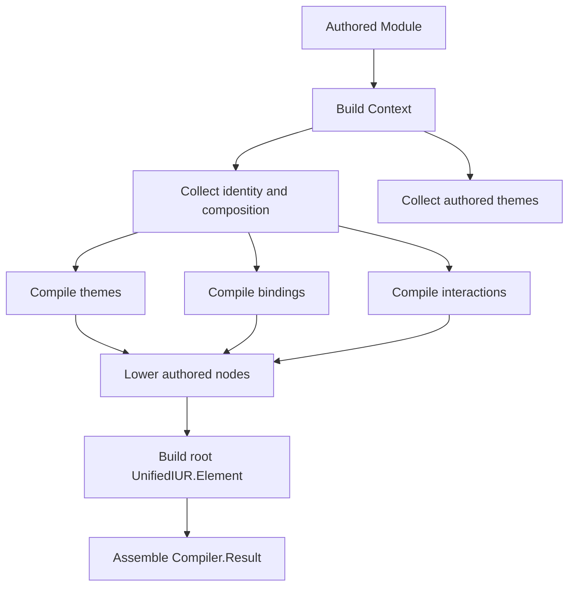
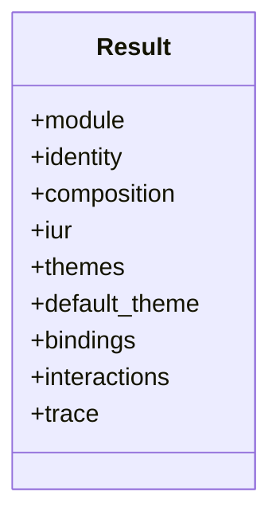
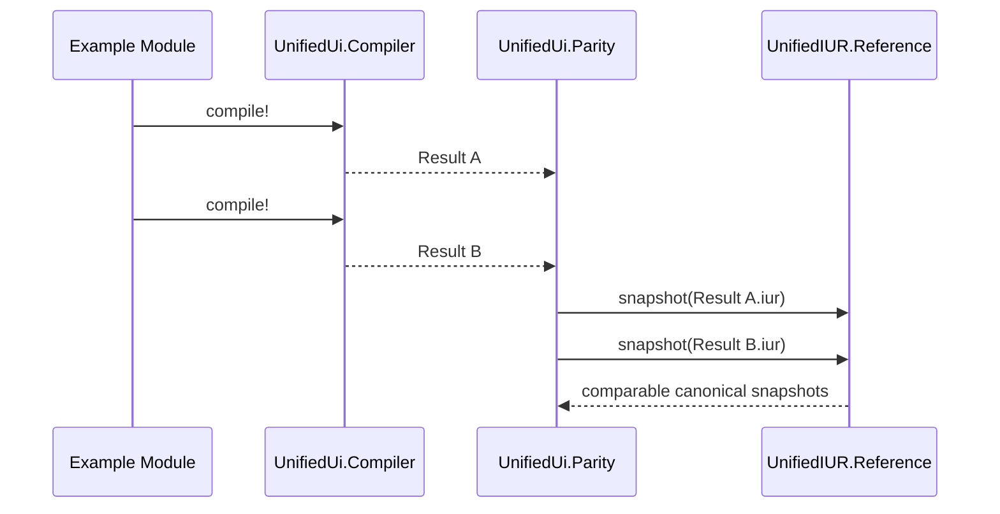

# UnifiedUi Compilation Pipeline

This guide explains how authored `UnifiedUi` modules become canonical
`UnifiedIUR` output and which intermediate artifacts developers can inspect.

## Table of Contents

1. [Public Compiler Entry Points](#public-compiler-entry-points)
2. [Pipeline Stages](#pipeline-stages)
3. [Compiler Result Shape](#compiler-result-shape)
4. [Inspection and Export Workflows](#inspection-and-export-workflows)
5. [Determinism and Parity](#determinism-and-parity)

## Public Compiler Entry Points

`UnifiedUi.Compiler` exposes the package’s public lowering API:

- `compile/2`
- `compile!/2`
- `compile_fragment/2`
- `iur/2`
- `iur!/2`
- `summary/2`
- `listing/2`
- `inspection/2`
- `render_inspection/2`

Use these entry points when you need:

- the full compiler result
- only the canonical `UnifiedIUR.Element`
- a review-friendly summary or listing
- an inspection report for docs or diagnostics

## Pipeline Stages

`UnifiedUi.Compiler.Pipeline.run/2` performs one deterministic pass from
authored module to compiled result.



### 1. Build Context

The pipeline starts by collecting authored data into an internal context:

- `identity`
- `composition`
- `default_theme`
- top-level nodes
- flattened node lookup by id
- authored themes
- authored ids

This stage is intentionally separate so later passes work from normalized
package data rather than reading directly from Spark sections again.

### 2. Compile Themes

`compile_themes/1` resolves authored theme inheritance and lowers:

- palette colors
- semantic roles
- token declarations
- component styles

The result includes:

- ordered compiled themes
- a theme lookup by id
- a compiled style lookup by authored style id

### 3. Compile Bindings and Interactions

The signals section is lowered into canonical `UnifiedIUR.Binding` and
`UnifiedIUR.Interaction` values. Bindings are compiled before interactions so
interaction targets can resolve binding references consistently.

### 4. Lower Authored Nodes

The composition tree is lowered into canonical `UnifiedIUR.Element` values.
During this step the compiler attaches:

- root metadata derived from identity and composition
- compiled theme attachment when a default theme exists
- compiled binding and interaction collections
- lowered child elements for the authored node tree

### 5. Assemble Result

The pipeline returns `UnifiedUi.Compiler.Result`, which keeps the canonical IUR
artifact together with authored and trace metadata.

## Compiler Result Shape

`UnifiedUi.Compiler.Result` contains the package’s main post-compile artifact:



Important result fields:

| Field | Purpose |
| --- | --- |
| `module` | The authored module that was compiled |
| `identity` | Normalized identity metadata |
| `composition` | Root mode, root id, summary, and slot metadata |
| `iur` | Canonical root `UnifiedIUR.Element` |
| `themes` | Compiled `UnifiedIUR.Theme` values |
| `bindings` | Compiled `UnifiedIUR.Binding` values |
| `interactions` | Compiled `UnifiedIUR.Interaction` values |
| `trace` | Authored ids and compiled lookup maps for diagnostics |

Two helper views are especially useful during development:

- `Result.summary/1` for concise compile output review
- `Result.listing/1` for authored-to-compiled inventory and trace data

## Inspection and Export Workflows

The package supports several ways to inspect compile output without a runtime.

### Direct compiler inspection

```elixir
UnifiedUi.Compiler.summary(MyModule)
UnifiedUi.Compiler.listing(MyModule)
UnifiedUi.Compiler.inspection(MyModule)
UnifiedUi.Compiler.render_inspection(MyModule)
```

### Review-friendly exports

`UnifiedUi.Export` currently supports:

- `:inspection`
- `:snapshot`
- `:signals`
- `:summary`
- `:diagnostics`
- `:coverage`

These are the formats behind workflows such as:

```bash
mix unified_ui.inspect --example foundational_screen
mix unified_ui.export --example themed_signal_workspace --format snapshot
mix unified_ui.validate
```

## Determinism and Parity

The compile pipeline is designed to be deterministic. `UnifiedUi.Parity`
validates that by compiling maintained examples repeatedly and comparing the
resulting canonical snapshots.



Parity work also checks that the authored construct catalog in `UnifiedUi`
remains synchronized with the canonical construct catalog exposed by
`UnifiedIUR`.
