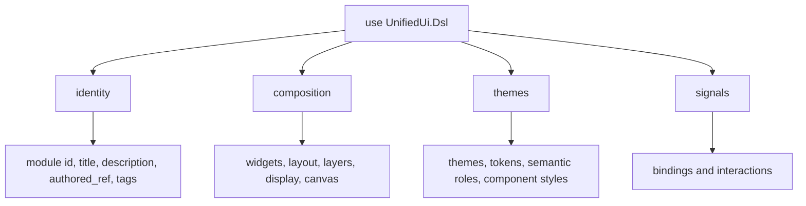
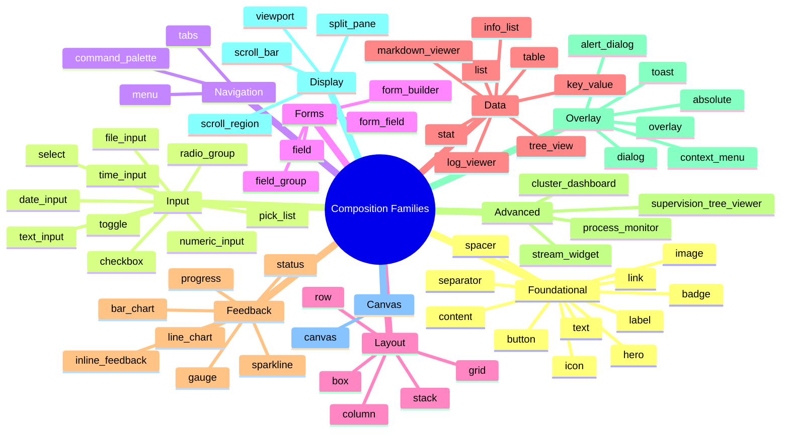

# UnifiedUi DSL Section Model

This guide explains how authored `UnifiedUi` modules are structured and how the
section model maps onto widgets, themes, bindings, and interactions.

## Table of Contents

1. [The Four Top-Level Sections](#the-four-top-level-sections)
2. [Section Registry and Extension Points](#section-registry-and-extension-points)
3. [Authored Module Shape](#authored-module-shape)
4. [Widget and Construct Families](#widget-and-construct-families)
5. [Style, Theme, and Signal Surfaces](#style-theme-and-signal-surfaces)

## The Four Top-Level Sections

`UnifiedUi.Dsl` is backed by `UnifiedUi.Dsl.Extension` and
`UnifiedUi.Dsl.SectionRegistry`. Today the authored model is built around four
top-level sections:

- `identity`
- `composition`
- `themes`
- `signals`



These sections are intentionally small in number. Most of the expressive power
comes from the entities registered under them, not from adding more top-level
entry points.

## Section Registry and Extension Points

`UnifiedUi.Dsl.SectionRegistry` is the authoritative registry for:

- supported section names
- extension points
- default section options

Current extension points are:

| Section | Extension Points |
| --- | --- |
| `identity` | `:metadata_fields`, `:traceability_fields` |
| `composition` | `:widget_entities`, `:layout_entities`, `:layer_entities` |
| `themes` | `:theme_entities`, `:style_entities`, `:token_entities` |
| `signals` | `:signal_entities`, `:binding_entities`, `:payload_entities` |

Current default section options are:

| Section | Defaults |
| --- | --- |
| `identity` | `annotations: %{}`, `tags: []` |
| `composition` | `mode: :screen` |
| `themes` | `inherit?: true` |
| `signals` | `mode: :canonical` |

## Authored Module Shape

At the package boundary, developers should think of a `UnifiedUi` module as a
declarative document that is later lowered into canonical data.

```elixir
defmodule ExampleScreen do
  use UnifiedUi.Dsl

  identity do
    id :example_screen
    title "Example Screen"
    description "Small authored screen used for package work."
  end

  composition do
    root :example_root
    mode :screen

    column :layout do
      text :title, value: "Hello"
      button :save, label: "Save", interaction_refs: [:save_clicked]
    end
  end

  themes do
    default_theme :app
  end

  signals do
    data_binding :draft_name, path: [:draft, :name]
    interaction :save_clicked, family: :click, intent: :save
  end
end
```

Each section has a different responsibility:

- `identity` names and traces the authored module
- `composition` declares node structure and root semantics
- `themes` declares authored theme values and style references
- `signals` declares bindings and interaction meaning

## Widget and Construct Families

The composition section is backed by entity families in
`UnifiedUi.Dsl.Entities.*`. The package keeps these families explicit so the
authored surface and parity catalog stay reviewable.



Most widget-like entities share a baseline schema, including fields such as:

- `id`
- `description`
- `authored_ref`
- `annotations`
- `tags`
- `variant`
- `tone`
- `theme_ref`
- `style_refs`
- `style`
- `interaction_refs`
- `binding_refs`
- `accessibility_label`
- `accessibility_description`
- `disabled?`

That common shape is what makes the compiler and introspection layers
consistent across families.

## Style, Theme, and Signal Surfaces

The non-composition sections are modeled as canonical authored values, not
renderer patches.

### Style and Theme

`UnifiedUi.Style` groups attributes into families:

- typography
- color
- spacing
- sizing
- alignment
- border
- visibility
- emphasis

`UnifiedUi.Theme` then composes those values into:

- `theme`
- `palette_color`
- `semantic_role`
- `token`
- `component_style`

### Signals and Bindings

`UnifiedUi.Binding` models canonical data bindings, while `UnifiedUi.Signal`
models interactions. Current interaction families are:

- `:click`
- `:change`
- `:submit`
- `:open`
- `:close`
- `:focus`
- `:selection`
- `:navigation`
- `:command`

### Helper Imports

`use UnifiedUi.Dsl` imports helpers from `UnifiedUi.Dsl.Helpers`, including:

- `named_color/1`
- `indexed_color/1`
- `rgb_color/3`
- `token_ref/1`
- `role_ref/1`
- `style_value/1`
- `binding_ref/1`

Those helpers exist to keep authored modules canonical and readable without
requiring callers to construct low-level structs by hand.
