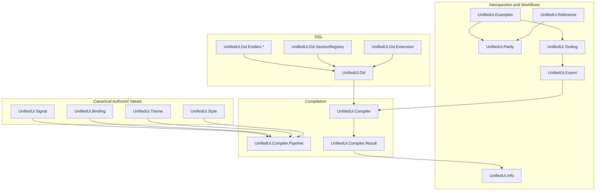

# UnifiedUi Package Components

This guide maps the main modules in `UnifiedUi` to their responsibilities so
developers can quickly find the right place to change code.

## Table of Contents

1. [Component Map](#component-map)
2. [Core Module Groups](#core-module-groups)
3. [Maintained Examples](#maintained-examples)
4. [Change Map](#change-map)

## Component Map

## Core Module Groups

### DSL Surface

| Module Group | Responsibility |
| --- | --- |
| `UnifiedUi.Dsl` | Public Spark-backed DSL entry point |
| `UnifiedUi.Dsl.Extension` | Registers sections, verifiers, and helper imports |
| `UnifiedUi.Dsl.SectionRegistry` | Defines section names, defaults, and extension points |
| `UnifiedUi.Dsl.Entities.*` | Defines widget, layout, overlay, display, and theme entities |

This layer is where authored surface changes begin.

### Canonical Authored Values

| Module | Responsibility |
| --- | --- |
| `UnifiedUi.Style` | Canonical authored style values and style-family metadata |
| `UnifiedUi.Theme` | Theme declarations, palette colors, semantic roles, tokens, and component styles |
| `UnifiedUi.Binding` | Canonical binding declarations and references |
| `UnifiedUi.Signal` | Canonical interaction declarations and signal families |

These modules normalize authored values before they are lowered into
`UnifiedIUR`.

### Compilation

| Module | Responsibility |
| --- | --- |
| `UnifiedUi.Compiler` | Public compile and inspection entry points |
| `UnifiedUi.Compiler.Pipeline` | Deterministic lowering passes |
| `UnifiedUi.Compiler.Result` | Structured compiled result and reporting helpers |

If you are changing how authored nodes become canonical elements, this is the
main area to read.

### Introspection and Workflow Support

| Module | Responsibility |
| --- | --- |
| `UnifiedUi.Info` | Per-module introspection summaries |
| `UnifiedUi.Reference` | Supported sections, families, rules, and package catalog |
| `UnifiedUi.Export` | Review-friendly text exports |
| `UnifiedUi.Parity` | Alignment checks against canonical `UnifiedIUR` |
| `UnifiedUi.Tooling` | Higher-level package validation and workflow helpers |

These modules are the package’s “developer console.” They turn code and specs
into reviewable artifacts.

## Maintained Examples

`UnifiedUi.Examples` is a contract surface, not just a convenience module. It
currently catalogs these maintained authored examples:

- `foundational_screen`
- `profile_form`
- `overlay_workspace`
- `operations_dashboard`
- `themed_signal_workspace`

Those examples carry documented categories, construct coverage, parity
obligations, and review artifacts. They are used by docs, exports, parity
validation, and `mix unified_ui.validate`.

## Change Map

Use this map when deciding where to make a change:

| If you need to change... | Start with... |
| --- | --- |
| a top-level authored section or section default | `UnifiedUi.Dsl.SectionRegistry` |
| helper imports available inside authored modules | `UnifiedUi.Dsl.Extension` and `UnifiedUi.Dsl.Helpers` |
| a widget or construct family | `UnifiedUi.Dsl.Entities.*` plus `UnifiedUi.Reference` |
| canonical style roles or attribute families | `UnifiedUi.Style` |
| theme declarations or token lowering | `UnifiedUi.Theme` and `UnifiedUi.Compiler.Pipeline` |
| binding or interaction shape | `UnifiedUi.Binding`, `UnifiedUi.Signal`, and the compiler pipeline |
| canonical lowering behavior | `UnifiedUi.Compiler.Pipeline` and `UnifiedUi.Compiler.Result` |
| inspection, export, or validation output | `UnifiedUi.Info`, `UnifiedUi.Export`, `UnifiedUi.Parity`, `UnifiedUi.Tooling` |
| package docs/examples coverage | `UnifiedUi.Examples`, `UnifiedUi.Tooling`, and `packages/unified-ui/docs/` |

When the change alters the authored or canonical package contract, update the
matching `.spec/specs/unified-ui/*` subjects in the same change set.
