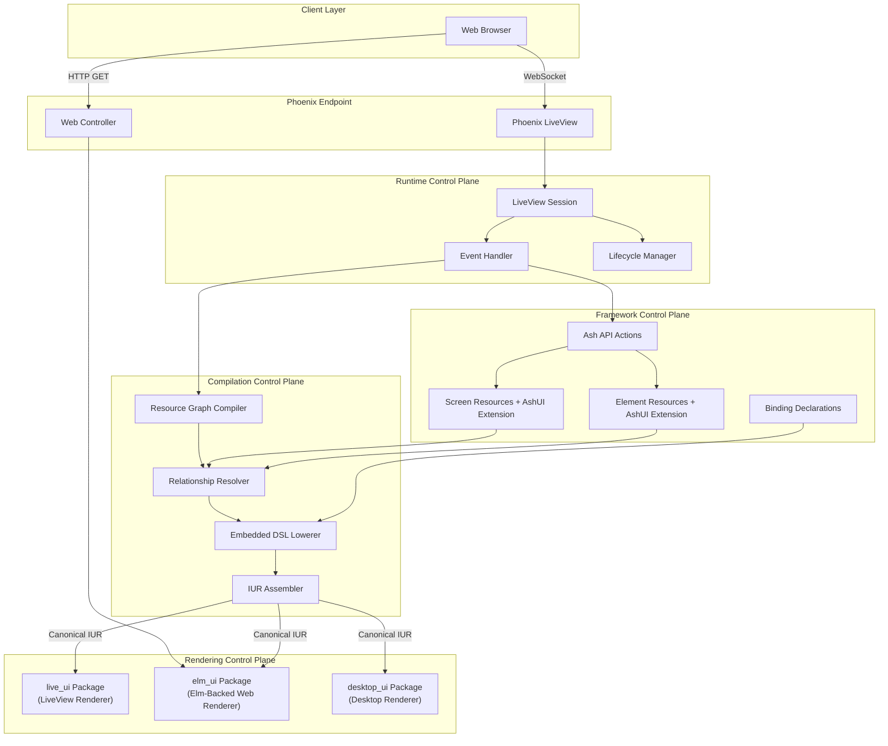

# Ash UI Topology

This document defines the canonical topology of the Ash UI framework,
including supervision boundaries, service ownership, and control plane
authority.

## System Overview

Ash UI is an Ash-resource-native UI framework. Screen resources and element
resources using the `AshUI` extension are the authoritative authoring surface.
Those resources compose through Ash relationships, carry embedded
`unified_ui` DSL fragments for widgets/layouts/themes, and compile to canonical
`unified_iur` for renderer packages.

## Control Plane Authority

### Framework Control Plane

**Owner**: `AshUI.Framework`

**Scope**: Ash-resource-native authoring, relationships, and extension contracts

**Authority**:
- defines the `AshUI` extension boundary on screen and element resources
- defines how bindings and interaction actions are declared on resources
- defines how resource relationships express composition
- does not reduce the system to monolithic screen-document authority

### Compilation Control Plane

**Owner**: `AshUI.Compilation`

**Scope**: resource graph -> IUR transformation

**Authority**:
- traverses screen and element relationships
- collects embedded DSL fragments, bindings, and actions from resources
- delegates embedded widget/layout/theming semantics to upstream `unified_ui`
- assembles canonical `unified_iur` for renderer packages

### Rendering Control Plane

**Owner**: `AshUI.Rendering`

**Scope**: output generation for target platforms via external renderer packages

**Authority**:
- accepts canonical `unified_iur`
- delegates rendering to `live_ui`, `elm_ui`, and `desktop_ui`
- does not own the authoring resource graph

### Runtime Control Plane

**Owner**: `AshUI.Runtime`

**Scope**: session lifecycle, event handling, and binding evaluation

**Authority**:
- mounts screen resources into session state
- evaluates screen-local and element-local bindings
- routes events to the owning resource/action boundary
- synchronizes updates after underlying Ash resource changes

## Canonical Data Flow

1. A screen resource is selected for mount.
2. Ash relationships load the related element resource graph.
3. The compiler collects embedded DSL fragments, bindings, and action
   declarations from the screen and elements.
4. Upstream `unified_ui` lowers those embedded fragments.
5. Ash UI assembles the relational graph into canonical `unified_iur`.
6. Renderer packages consume canonical output.

## Related Specifications

- [contracts/resource_contract.md](contracts/resource_contract.md)
- [contracts/screen_contract.md](contracts/screen_contract.md)
- [contracts/compilation_contract.md](contracts/compilation_contract.md)
- [adr/ADR-0005-element-resource-authority-and-relational-screen-composition.md](adr/ADR-0005-element-resource-authority-and-relational-screen-composition.md)
